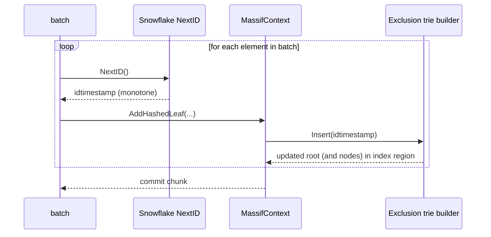
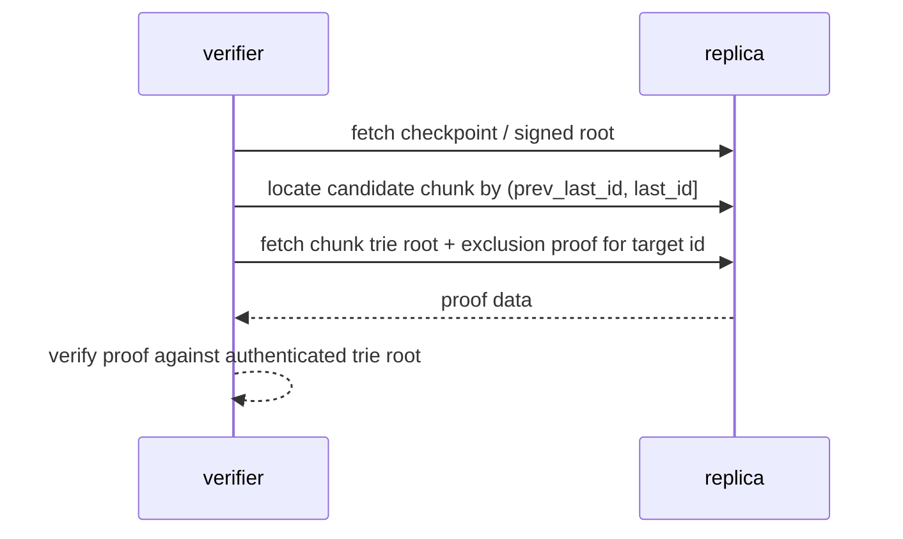

# ARC: Massif Exclusion Trie (bounded, incremental)

## Status

Draft.

## Abstract

Forestrie uses an append-only Merkle Mountain Range (MMR) log,
chunked into fixed-size massifs,
and assigns each committed leaf a 64-bit monotone `idtimestamp` (Snowflake64).

Inclusion proofs in an append-only log are stable: once a leaf is added,
it is never removed.
This stability is what makes our MMR "sign the peaks" approach so effective:
we can pre-sign and reuse receipts for accumulator peaks and attach per-leaf inclusion paths later.

By contrast, exclusion is generally not stable:
an item proven absent as of a checkpoint may become present after later appends,
so exclusion proofs are state-relative.
Even with our strict trie-order key guarantee (which enables append-only Urkle construction and a `last_id` chain for chunk selection),
an accumulator-style "pre-sign a small set of roots" optimization does not apply cleanly to trie exclusion because proofs are query-specific and the trie root changes with each insertion until a chunk is closed.

This ARC proposes using the massif's fixed index budget to maintain a cryptographically verifiable exclusion trie keyed by `idtimestamp`,
enabling efficient exclusion proofs at chunk scope and (via chunk range metadata) over the whole log.

The primary design choice is an Urkle-style postorder encoding with write-once,
append-only node emission,
which is safe and efficient given the hard requirement that log builders present keys in strict trie order.

Trie leaves commit to `(content_hash, leaf_ordinal)` so that inclusion verification yields an authenticated `key -> mmrIndex -> content_hash` mapping,
where `mmrIndex` is derived from `leaf_ordinal` and the chunk header context.

## Context

The key environmental facts this design relies on are:

- Massifs are incrementally filled until complete, then never change again.
- The log and checkpoints already anticipate multiple entry types via domain separation and versioning (see `rootsigner.go` and `mmriver.go`).
- The massif start header already persists `last_id` (`MassifStart.LastID`),
  which enables a `last_id` chain for deriving chunk key ranges.

## Problems and scope

We want to solve:

- **Exclusion proofs**:
  provide a cryptographically verifiable proof that a key is absent (and optionally present),
  without scanning whole chunks.
- **Bounded storage**:
  keep index/trie storage within a hard bound derived from the chunk leaf capacity `N` (and an index budget such as `N*1024` bytes).
- **Incremental building**:
  support efficient batch appends while a chunk is open,
  and stable proofs once a chunk is complete.
- **Position recovery**:
  allow efficient recovery of `mmrIndex` from an inclusion proof,
  while committing the application value as `content_hash`.
- **Anchoring**:
  cryptographically bind per-chunk trie roots (and range metadata) to signed checkpoints without unbounded write amplification.

In scope:

- Trie/index options for efficient construction and bounded storage.
- Proof formats and verifier expectations at a high level.
- Checkpoint anchoring strategies and their trade-offs.
- Required interface changes in `MassifContext` (design only).

## Non-goals

- Implementing code changes (this ARC is design-only).
- UUID encodings or external identifier formats.
- Choosing a final checkpoint anchoring strategy and wire format.
  (This is explicitly called out as follow-up work.)

## Critical key properties (application guarantees)

The exclusion-trie key is the commit-time `idtimestamp` (Snowflake64),
with these invariants:

1. It is **64-bit, time-ordered, and unique** within a log.
2. It is serialized in **network byte order**,
   time bits first and uniqueness bits last.
3. The generator and writer enforce **numerical monotonicity** while the log is built,
   so `lastId < newId` is an invariant.
4. In the storage format, each chunk can store at most `N` leaves,
   and we can preallocate a fixed index budget derived from `N`.
5. Chunks are extended incrementally (often in batches),
   and we want the trie builder to be incremental as well.

These properties are enforced by the Snowflake generator implementation and by how writers use it.

See:

- `arbor/services/_deps/go-merklelog/massifs/snowflakeid/nextid.go`
- `arbor/services/_deps/go-merklelog/massifs/massifcontext.go`

## Key encoding, order, and trie bit numbering

### Key bytes (network order)

`idtimestamp` is a 64-bit integer.
It is serialized big-endian (network byte order).

In the current Snowflake layout, the 64 bits are split into:

- 40 bits: millisecond time (relative to the commitment epoch)
- 24 bits: worker discriminator + per-millisecond sequence

```text
uint64 idtimestamp (big-endian / network byte order)

MSB                                                            LSB
bit 63                                                      bit 0
+-----------------------------+-------------------------------+
| time_ms (40 bits)           | worker_id || seq (24 bits)    |
| (monotone ms since epoch)   | (uniqueness within log)       |
+-----------------------------+-------------------------------+

byte offsets in network order:
  [0] [1] [2] [3] [4] [5] [6] [7]
   ^ time-first                     ^ uniqueness-last
```

### Trie order and bit numbering

Because the key is fixed-width and big-endian:

- `newId > lastId` as `uint64` implies `KeyBytesBE(newId)` is lexicographically greater than `KeyBytesBE(lastId)`.

For a binary trie over 64-bit keys, define bit numbering MSB-first:

```text
bit index:   0   1   2   ...                         62  63
meaning:    MSB                                         LSB
```

This must be the bit order used by the trie implementation.
If the trie uses a different bit order,
the "keys arrive in trie order" guarantee does not hold.

## Existing massif/index context (today)

The current `_deps` massif format provides:

- `ValueBytes = 32` (`massifs/logformat.go`)
- A 256-byte start header: `StartHeaderSize = 32 + 7*32`,
  where the reserved slots are explicitly described as space for an "urkle trie root" and related material.
- An index region derived from `massifHeight` and constants,
  written via `MassifContext.AddHashedLeaf` and `SetIndexFields`.

Key entry points:

- `MassifContext.AddHashedLeaf(...)`
  writes index fields and appends the MMR leaf (`massifs/massifcontext.go`).
- `MassifContext.setLastIDTimestamp(...)`
  persists the last idtimestamp in the start header (`massifs/massifcontext.go`).

This ARC proposes a new,
versioned use of fixed index space to store a verifiable exclusion trie keyed by `idtimestamp`.

The following sections explore design options that satisfy the requirements listed in "Problems and scope".

## Options discussed: efficient creation and bounded storage

### Option 0: fixed per-leaf table + scan (no trie)

Store `idtimestamp` per leaf, and answer membership queries by scanning.

- **Bound**: `O(N)` bytes with a fixed record size.
- **Incremental**: trivial, one slot per appended leaf.
- **Foot gun**: does not provide cryptographic exclusion by itself.

This is a useful baseline,
but it does not satisfy the "verifiable exclusion proof" goal unless paired with another authenticated structure.

### Option 1: Bloom filter and range metadata (prefilter only)

We discussed Bloom filters as a way to avoid scanning a chunk when the key is definitely not present.

For `idtimestamp` specifically, a simpler exact prefilter often dominates:

- Use the chunk's `last_id` (max key) from the start record.
- Use the previous chunk's `last_id` as the exclusive lower bound.
- If `id <= prev_last_id` or `id > last_id`, the chunk cannot contain it.

Bloom filters remain useful for hash-like keys (e.g., leaf hashes),
but they are not the proof mechanism.

Key point:

- Bloom/range prefilters can reduce I/O.
- They do not provide cryptographic exclusion proofs.

#### Bloom mechanics and serialization

A Bloom filter is a fixed-size bitset that supports membership queries:

- Insert(x): set `k` bits derived from x.
- Query(x): if any of those bits are 0, x is definitely absent. If all are 1,
  x is "maybe present" (false positives are possible).

Elements we discussed:

- **idtimestamp**: 8-byte big-endian `idtimestamp`.
  (Optionally include commitment epoch if verifiers do not already have it.)
- **leaf hash**: 32-byte digest (already hash-like).

Parameterization (fixed, derived from `N`):

- Choose a constant bits-per-element `b` (e.g., 10..16).
- Set `mBits = b * N`.
- Set `k = round(mBits/N * ln(2))` (typically `round(0.693 * b)`).

Index derivation (double hashing):

- Pick `h1` and `h2` as 64-bit values derived from the element bytes.
- For `i = 0..k-1`: `idx_i = (h1 + i*h2) mod mBits`.

Bit numbering (must be specified):

```text
bitset bytes: b[0], b[1], ...

bit index j:
  byte = j / 8
  bit  = j % 8

bit order option A (LSB-first):
  bit 0 is (b[0] & 0x01)

bit order option B (MSB-first):
  bit 0 is (b[0] & 0x80)
```

Serialization inside the massif index region (fixed bound):

- a fixed-size Bloom header
- then the raw bitset bytes, where `len = ceil(mBits/8)`,
  optionally padded to 32-byte alignment

Example header fields (illustrative):

```text
struct BloomHeaderV1 {
  magic[4]      = "BLM1"
  version[2]
  flags[2]      // hasLeafBloom, hasIdBloom, bit order, etc
  nFilled[4]    // how many leaves inserted so far
  mBits[4]
  k[1]
  hashId[1]     // e.g., 1=SHA-256, 2=SHA3-256, etc
  reserved[...] // pad to fixed size (e.g., 32B or 128B)
}
```

Go sketch for double hashing:

```go
func bloomIdx(h1, h2 uint64, i uint64, mBits uint64) uint64 {
  return (h1 + i*h2) % mBits
}
```

### Option 2: in-place Patricia / crit-bit trie in a fixed node pool

We discussed using a compressed binary trie (Patricia / crit-bit) because it has a clean node-count bound expressed only in terms of `N`:

- For `N` distinct keys, total nodes is `<= 2N - 1`.
  (N leaves + at most N−1 branch nodes.)

This gives a hard bound:

```text
node_pool_bytes <= (2N - 1) * NODE_BYTES
```

Properties:

- **Bounded**: depends only on `N` and `NODE_BYTES`.
- **Incremental**: each insert updates only a small search path.
- **Writer-friendly**: updates can be done in place inside the chunk buffer.

Foot guns to manage:

- You must reserve enough space for `(2N-1)` nodes plus metadata.
- You must define a stable, versioned node encoding and hash function.

### Option 3: append-only postorder trie stream (Urkle-style)

Enabled by sorted keys.

We discussed the classic trie foot gun:

- inserting new keys can require rewriting internal nodes (hash updates),
  which breaks append-only postorder encodings

Your invariants materially change that picture:

- keys arrive in strict trie order (big-endian, MSB-first, monotone ids)
- no key ever arrives "between" two earlier keys

This enables a streaming construction from sorted keys:

- keep an in-memory "frontier" (stack) for the rightmost path
- when the next key arrives,
  finalize and emit any subtrees that are now known to be complete forever

Key foot guns that remain:

- Ordering mismatch (endianness or bit order) breaks safety.
- A single out-of-order key invalidates the stream,
  so the builder must enforce `newKey > lastKey`.

Hard bounds:

- For a per-chunk trie over exactly `N` keys,
  you can still target `<= 2N-1` nodes (Patricia),
  and postorder is just a serialization choice.
- For a whole-log trie spanning chunks,
  you must also persist enough frontier state at chunk boundaries to resume safely.
  Frontier depth is bounded by key bit length (64),
  but the exact per-chunk byte budget depends on the chosen encoding.

#### Option 3 example: strict append-only builder from sorted keys (Go)

This example shows an **append-only** construction of a binary "Urkle-like" trie (a hashed,
compressed binary trie) when keys arrive in strict trie order.

Key idea:

- We maintain a stack of "open" branch frames.
- We maintain a `pending` subtree reference for the current rightmost subtree.
- When the common prefix length (LCP) with the previous key decreases,
  we close frames and emit branch nodes in postorder.

Because `lastId < newId` and keys are big-endian MSB-first:

- the left side of a new branch is complete at the moment the branch is introduced,
  and
- the right side becomes complete before that branch is closed.

So we can emit nodes strictly append-only without rewriting earlier nodes.

##### Node emission API (append-only)

In a massif, the "node store" region can be a fixed-size record array.
An emitter allocates node indices monotonically and writes each record once.

```text
node_ref = 0, 1, 2, ... (monotone)
offset   = node_store_base + node_ref * NODE_BYTES
```

##### Builder algorithm sketch

```go
package urkle

import (
  "crypto/sha256"
  "encoding/binary"
  "fmt"
  "math/bits"
)

type Ref uint32

type Emitter interface {
  EmitLeaf(key, val uint64) (ref Ref, h [32]byte, err error)
  EmitBranch(bit uint8, left, right Ref) (ref Ref, h [32]byte, err error)
}

// lcpBits returns the number of common prefix bits (MSB-first) in [0..63].
func lcpBits(a, b uint64) (uint8, error) {
  x := a ^ b
  if x == 0 {
    return 0, fmt.Errorf("duplicate key: %016x", a)
  }
  return uint8(bits.LeadingZeros64(x)), nil
}

type frame struct {
  bit  uint8
  left Ref
}

type Builder struct {
  emit Emitter

  lastKeyOk bool
  lastKey   uint64

  // pending is the current rightmost subtree root.
  pending Ref

  // stack is strictly increasing in bit index.
  stack []frame
}

func NewBuilder(e Emitter) *Builder {
  return &Builder{emit: e}
}

func (b *Builder) InsertMonotone(key, val uint64) error {
  // Crucial: append-only emission requires keys in strict trie order.
  // Without strict order we'd need rewrites, not postorder append-only.
  if b.lastKeyOk && key <= b.lastKey {
    return fmt.Errorf("out of order: %016x <= %016x", key, b.lastKey)
  }

  leafRef, _, err := b.emit.EmitLeaf(key, val)
  if err != nil {
    return err
  }

  if !b.lastKeyOk {
    b.pending = leafRef
    b.lastKeyOk = true
    b.lastKey = key
    return nil
  }

  // Crucial: LCP is MSB-first and must match the trie traversal bit order.
  l, err := lcpBits(b.lastKey, key)
  if err != nil {
    return err
  }

  // Crucial: safe to close frames only because future keys are to the right.
  // If keys were unsorted, closing would be unsound without rewriting.
  for len(b.stack) > 0 && b.stack[len(b.stack)-1].bit > l {
    top := b.stack[len(b.stack)-1]
    b.stack = b.stack[:len(b.stack)-1]

    brRef, _, err := b.emit.EmitBranch(top.bit, top.left, b.pending)
    if err != nil {
      return err
    }
    b.pending = brRef
  }

  // Crucial: opening a frame commits the current left subtree due to sorting.
  if len(b.stack) == 0 || b.stack[len(b.stack)-1].bit < l {
    b.stack = append(b.stack, frame{bit: l, left: b.pending})
  }

  // Current key is now the rightmost subtree.
  b.pending = leafRef
  b.lastKey = key
  return nil
}

func (b *Builder) Finalize() (Ref, error) {
  // Close everything remaining.
  for i := len(b.stack) - 1; i >= 0; i-- {
    top := b.stack[i]
    brRef, _, err := b.emit.EmitBranch(top.bit, top.left, b.pending)
    if err != nil {
      return 0, err
    }
    b.pending = brRef
  }
  b.stack = nil
  return b.pending, nil
}

// One possible hash scheme (domain separated).
func hashLeaf(key, val uint64) [32]byte {
  var out [32]byte
  var buf [1 + 8 + 8]byte
  buf[0] = 0x00
  binary.BigEndian.PutUint64(buf[1:9], key)
  binary.BigEndian.PutUint64(buf[9:17], val)
  sum := sha256.Sum256(buf[:])
  copy(out[:], sum[:])
  return out
}

func hashBranch(bit uint8, left, right [32]byte) [32]byte {
  var out [32]byte
  var buf [1 + 1 + 32 + 32]byte
  buf[0] = 0x01
  buf[1] = bit
  copy(buf[2:34], left[:])
  copy(buf[34:66], right[:])
  sum := sha256.Sum256(buf[:])
  copy(out[:], sum[:])
  return out
}
```

Notes:

- `val` can be the leaf's MMR index,
  or any application-defined payload that should be committed by the trie.
- The builder is "strict append-only" in the sense that emitted nodes are written once in increasing `Ref` order.
- The only state that must persist across batches is `lastKey`, `pending`,
  and the `stack` frames.

## Urkle (postorder) vs Patricia (node pool)

This section compares the two primary trie approaches discussed here:

- Urkle-style append-only postorder encoding (Option 3)
- Patricia / crit-bit node pool (Option 2)

The comparison focuses on:

- space efficiency
- bounded storage
- incremental building
- "whole trie" testing approaches

### Space efficiency

Urkle (postorder):

- **Potentially lower per-node overhead** if children are implicit in the postorder stream and node records do not need explicit child pointers.
- **Leaf payload cost is explicit**:
  if you need `mmrIndex` recovery from inclusion,
  the leaf hash must commit to the payload (e.g., leaf ordinal or `mmrIndex`),
  so those bytes are unavoidable.
- **May require a side index** (key -> node ref) if you want fast proof extraction without scanning the postorder stream.

Patricia (node pool):

- **Predictable per-node overhead**: each node record typically stores `bit`,
  child refs, and a hash (and leaf payload as needed).
- **No side index is strictly required** for proof generation if the node pool stores sufficient structure,
  but you still need a way to locate the leaf for a key (often via trie traversal from the root).

### Bounded storage

Urkle (postorder):

- **Bound depends on node encoding choices**.
  If you represent a compressed binary trie,
  node count can still be bounded by `<= 2N-1` for `N` unique keys,
  and frontier state is bounded by key length (64 bits).
- **Hard requirement**:
  the strict append-only algorithm depends on keys arriving in strict trie order (`lastId < newId`).

Patricia (node pool):

- **Cleanest bound**: `<= 2N-1` nodes for `N` unique keys.
  Storage is `node_pool_bytes <= (2N-1) * NODE_BYTES`, plus small metadata.
- **Does not depend on key order for correctness**.

### Incremental building

Urkle (postorder):

- **Append-only writes**: emitted nodes are written once,
  which matches the "MMR-like" update model well.
- **Very cheap incremental updates**:
  stack push/pop + a small number of node emits per key.
- **Batch-friendly**: inserting keys in batches is natural;
  you only need to persist the frontier (`lastKey`, `pending`,
  `stack`) to resume.

Patricia (node pool):

- **Random-access updates**: insertions require updates on the search path,
  and re-hashing up to the root.
- Still incremental and bounded, but not write-once.

### Whole-trie tests (recommended)

Urkle (postorder):

- **Order invariants**:
  - test that `InsertMonotone` rejects `newKey <= lastKey`
  - test that MSB-first bit ordering matches big-endian key bytes
- **Batch equivalence**:
  - build with one-by-one inserts vs batch inserts (same final root)
  - build with artificial "chunk boundary" snapshots of frontier state, resume,
    and ensure the final root matches a no-boundary build
- **Reference equivalence**:
  - compare the produced root to a reference Patricia build over the same key set (since both represent the same compressed trie)

Patricia (node pool):

- **Order independence** (if desired):
  - insert keys in random order and verify the final root matches insertion in sorted order (depends on deterministic tie-breaking and encoding)
- **Proof round-trips**:
  - for random keys, generate inclusion proofs and verify against the root
  - for random missing keys, generate exclusion proofs and verify against root

## Recovering `mmrIndex` from trie membership

Yes, it can be done efficiently,
but only if the trie commits to an application-defined value at the leaf.

Key point:

- A membership check that only proves "key exists" does not, by itself,
  identify the leaf's position in the MMR.
- To recover `mmrIndex`, the trie must map `key -> position`,
  where "position" is committed as leaf payload.

### Option A: store absolute `mmrIndex` as the leaf value

Store `mmrIndex` (uint64) as the trie leaf payload and commit to it in the leaf hash.

Then:

- inclusion proof verifies the leaf hash and returns `mmrIndex`
- recovery is O(log N) proof verification + O(1) parsing

Pros:

- Direct: proof yields the exact `mmrIndex` without additional context.
- Stable across chunk format changes, as long as `mmrIndex` semantics remain.

Cons:

- Always costs 8 bytes per leaf payload,
  even when a smaller ordinal would suffice.
- Couples the trie leaf value to global MMR indexing details.

### Option B: store leaf ordinal within the chunk and derive `mmrIndex`

If each chunk stores up to `N` leaves, a local ordinal fits in `log2(N)` bits.

Store:

- `leaf_ordinal` within the chunk (e.g., 0..N-1)

Given the chunk's `FirstIndex` (MMR index of the first leaf), compute:

```go
// leafOrdinal is the leaf index within the chunk (0..N-1).
// firstIndex is MassifStart.FirstIndex (MMR index of the first leaf).
firstLeafIndex := mmr.LeafCount(firstIndex)
mmrIndex := mmr.MMRIndex(firstLeafIndex + leafOrdinal)
```

This is space-efficient and still yields an efficient `mmrIndex` recovery.

Note:

- Because `N` is fixed per chunk and (in our format) is a power of two,
  the required bit width is a constant `w = log2(N)` for all leaves in the chunk.
  This means you can store `leaf_ordinal` as a fixed-width integer field (e.g.,
  `uint16` or `uint32`) and avoid variable-length bit packing.

Pros:

- More space efficient: ordinal can be smaller than 8 bytes, depending on `N`.
- Naturally chunk-local: pairs well with per-chunk tries and range metadata.

Cons:

- Requires additional authenticated context to compute `mmrIndex`:
  the chunk's `FirstIndex` (and correct interpretation of MMR indexing).
- If you later want to use the trie root independent of chunk context,
  you must also carry the chunk identifier and its `FirstIndex`.

### Independence from application value storage

Options A and B are about how to commit to a **position** for `mmrIndex` recovery (absolute `mmrIndex` vs chunk-local ordinal).

They are not strictly tied to what you consider the "application value".

If you want the key to commit to the **content hash** (and allow duplicate content across different keys),
you can define the leaf payload as a tuple:

- `value = content_hash` (32 bytes, e.g., SHA3-256)
- `pos = mmrIndex` (Option A) or `pos = leaf_ordinal` (Option B)

and commit to both inside the leaf hash preimage.

If you store only `content_hash` and do not commit to any `pos`, then:

- you can still *find* `mmrIndex` operationally (e.g.,
  by searching a key table), but
- you cannot recover an authenticated `mmrIndex` from the trie proof alone.

### If the trie does not store a value

If leaves commit only to keys, then:

- inclusion proves presence,
  but you cannot efficiently recover `mmrIndex` from the proof alone

You would need an additional authenticated mapping (or augment the trie with order-statistics such as subtree sizes).

## Single-chunk vs whole-log exclusion

### Efficient exclusion within a single chunk

If each chunk stores a trie over its own keys:

- Exclusion proofs are local and efficient.
- Storage bound is expressed directly in terms of `N`.

### Whole-log exclusion using monotone chunk key ranges

Because keys are monotone and chunks are built in key order:

- each chunk has a contiguous range,
  and can be described by its upper bound `last_id` (the max key in the chunk)
- ranges are ordered and non-overlapping,
  and the lower bound for a chunk can be derived from the previous chunk's `last_id`.

In the current massif format,
`last_id` is already present in the start record (`MassifStart.LastID`).

This enables a whole-log exclusion strategy that does not require a global trie:

1. identify the single candidate chunk by range
2. prove absence within that chunk's trie
3. prove the chunk range and trie root are authenticated

Step (3) is essential: without anchoring, the trie is just auxiliary data.

## Proposed storage layout

This ARC assumes an index budget of `N*1024` bytes per chunk.
It does not require that the budget be physically arranged as `N` slots.

### Start header reserved slots

The start header already includes 7 reserved 32-byte slots.
A versioned exclusion-trie design can use them for:

```text
StartHeaderSize = 256 bytes (8 * 32B words)

word 0: massif start record (existing)
word 1: exclusion_trie_root_hash (32B)
word 2: exclusion_trie_params (encoding version, hash id, ...)
word 3: optional chunk_prev_last_id (uint64 big-endian, min exclusive)
word 4: node store counters (node_count, free_ptr, ...)
word 5: optional: frontier snapshot (for postorder streaming)
word 6: optional: frontier snapshot (continued)
word 7: optional: bloom params or future use
```

Note:

- The chunk's `last_id` (max key) is already in the start record (`MassifStart.LastID`),
  so you do not need to duplicate it here.
- If you do not store `chunk_prev_last_id`,
  it can be obtained from the previous chunk's start record.

### Index region carving (within N*1024 bytes)

One concrete carving is:

```text
IndexStart:

  +----------------------+  fixed size, 32B-aligned
  | index header         |
  +----------------------+  optional, f(N), 32B-aligned
  | bloom / prefilter    |
  +----------------------+  fixed per-leaf record size
  | leaf table           |  N * LEAF_REC_BYTES
  +----------------------+  bounded by N
  | trie node store      |  <= (2N-1) * NODE_BYTES
  +----------------------+  must be <= N*1024 total
```

### Persisting the Urkle frontier between massif updates

Option 3 (Urkle-style postorder) is append-only, but it is not "stateless".
To resume incremental building after persisting and reloading an open massif,
the writer must persist the builder's frontier state.

Intuition:

- Postorder emission writes completed subtrees immediately.
- The builder keeps a small "frontier" stack of left-subtree roots waiting for their right sibling,
  plus the most recent key.
- This frontier is the only mutable state needed to continue inserting keys without rescanning the chunk.

#### What must be persisted

At minimum:

- `last_key` (uint64 big-endian): last inserted `idtimestamp`
- `pending_ref`: root ref of the current pending subtree (or "none")
- `depth`: number of active frames
- `frames[0..depth)`: each frame stores:
  - `bit` (0..63, MSB-first) and
  - `left_ref` (ref to a node in the node store)

The node store itself is append-only and already persisted in the index region.

#### One concrete on-disk encoding (bounded, fixed size)

Store a fixed-size `FrontierStateV1` block in the index header region.
This is inside the preallocated index space and is updated on each batch append.

```text
FrontierStateV1 (fixed size, stored in index header region)

offset  size  field
0       4     magic "FNT1"
4       1     version = 1
5       1     key_bits = 64
6       2     reserved
8       8     last_key_be8
16      4     pending_ref_be4 (0xffffffff = none)
20      1     depth (0..64)
21      3     reserved
24      8*64  frames[64] (only first depth are used)

frame (8 bytes)
0       1     bit index (0..63, MSB-first)
1       3     reserved
4       4     left_ref_be4
```

This layout is intentionally simple:

- `left_ref` can be a node index into the append-only node store.
- The verifier does not need the frontier; only builders need it.

#### Why it always fits in the preallocated index region

The frontier size is bounded by the key bit width, not by the number of leaves:

- `max_depth <= key_bits = 64` (MSB-first binary trie over uint64 keys)
- With 8 bytes per frame and a ~24-byte header:
  - `FrontierStateV1Bytes = 24 + 64*8 = 536 bytes`

This is a constant overhead per chunk,
and it is tiny relative to the preallocated index budget (e.g.,
`N*1024` bytes).

Because our `idtimestamp` keys are strictly monotone in trie order,
the builder never needs to rewrite emitted nodes; it only updates:

- the node store append pointer / counters, and
- this bounded frontier block.

#### Assessment: massif peak stack as a model for an Urkle frontier

The existing massif format already relies on a persisted,
bounded stack for MMR continuation across blobs: the **ancestor peak stack**.

Relevant code and primitives:

- Layout and fixed sizing:
  - `MassifContext.LogStart()` places the log after `ValueBytes*MaxMMRHeight` of peak stack space (versioned behavior).
  - `StartNextMassif()` appends the computed peak stack and pads with zeros up to the fixed allocation for versioned formats.
- Stack update is pure push/pop with bit primitives:
  - `NextPeakStack()` computes `pop := mmr.SpurHeightLeaf(massifIndex)`,
    then truncates the stack and appends the previous blob's last value.
  - `mmr.SpurHeightLeaf()` uses `bits.TrailingZeros64(leafIndex+1)` to obtain a height-like value cheaply.
  - `mmr.LeafMinusSpurSum()` yields the expected stack length (used as a consistency check and to populate `PeakStackLen`).
- Stack consumption is order-aware:
  - On the last leaf append,
    `AddHashedLeaf()` initializes `nextAncestor` and `Get()` consumes stacked peaks in a known order without needing a map.
  - A map (`PeakStackMap`) exists for random access,
    but is avoided on the hot append path.

Why this is a good model for the Urkle frontier snapshot:

- Both the peak stack and the Urkle frontier are:
  - **bounded stacks** with a small maximum depth
  - **persisted inside the blob** so a builder can resume without scanning
  - updated by **cheap push/pop** operations
  - naturally compatible with a **fixed preallocation** plus a logical `depth` (unused slots are zero)

Key difference:

- Peak stack entries are 32-byte values needed by verifiers and builders to compute MMR nodes that span blobs.
- The Urkle frontier snapshot is **builder-only** state;
  verifiers do not need it,
  and it must not be treated as authenticated unless it is explicitly committed by a checkpoint.

Takeaway:

- We can safely mirror the peak stack pattern for Urkle frontier persistence:
  fixed-size allocation (bounded by 64), an explicit depth,
  and bit-primitive derived arithmetic where useful,
  while keeping the frontier out of the authenticated surface unless we deliberately anchor it.

### Example fixed node record (Option 2)

This is only an example; it illustrates how to compute a bound.
Assume `NODE_BYTES = 64`.

```text
Node record (64 bytes), all integers big-endian

offset  size  meaning
0       1     kind: 1=leaf, 2=branch
1       1     bit index (0..63, MSB-first), branch only
2       2     reserved
4       4     left child index (uint32), branch only
8       4     right child index (uint32), branch only
12      4     parent index (uint32), optional
16      8     key (uint64), leaf only
24      8     value (uint64), optional (e.g., mmr leaf index)
32      32    node hash (32 bytes)
```

Hard bound for the node store:

```text
node_store_bytes <= (2N - 1) * 64
```

## Incremental algorithms (example Go code)

These snippets are design sketches.
They are intended to be specific enough to evaluate bounds and interfaces.

### Bit utilities (MSB-first)

```go
import "math/bits"

// bitAt returns the bit at index i where i=0 is the MSB (bit 63).
// Crucial: MSB-first matches the big-endian trie order assumption.
func bitAt(x uint64, i uint8) uint8 {
  shift := 63 - i
  return uint8((x >> shift) & 1)
}

// critBit returns the first differing bit index (MSB-first) between a and b.
// It returns (ok=false) if a==b.
func critBit(a, b uint64) (idx uint8, ok bool) {
  x := a ^ b
  if x == 0 {
    return 0, false
  }
  lz := bits.LeadingZeros64(x) // 0..64
  return uint8(lz), true       // lz counts MSB-first equal bits
}
```

### Option 2 sketch: bounded Patricia insertion

This sketch assumes:

- fixed node pool sized to `(2N-1)`
- each insert creates exactly one new leaf and one new branch (except the first insert)

```go
type NodeKind uint8

const (
  KindLeaf   NodeKind = 1
  KindBranch NodeKind = 2
)

type Node struct {
  Kind   NodeKind
  Bit    uint8
  _      [2]byte
  Left   uint32
  Right  uint32
  Parent uint32
  Key    uint64
  Value  uint64
  Hash   [32]byte
}

const NoIndex = ^uint32(0)

type Pool struct {
  Nodes []Node
  Root  uint32

  Used      uint32
  LastKey   uint64
  LastKeyOk bool
}

func (p *Pool) allocNode() (uint32, *Node, error) {
  if p.Used >= uint32(len(p.Nodes)) {
    return 0, nil, fmt.Errorf("node pool exhausted")
  }
  i := p.Used
  p.Used++
  return i, &p.Nodes[i], nil
}

func (p *Pool) InsertMonotone(id uint64, value uint64) error {
  // Note: Patricia insertion does not require sorted keys for correctness.
  // We enforce monotonicity to match the log invariant and simplify ranges.
  if p.LastKeyOk && id <= p.LastKey {
    return fmt.Errorf("out of order: %016x <= %016x", id, p.LastKey)
  }

  if p.Used == 0 {
    li, ln, err := p.allocNode()
    if err != nil {
      return err
    }
    *ln = Node{Kind: KindLeaf, Key: id, Value: value}
    ln.Parent = NoIndex
    ln.Hash = HashLeaf(id, value)
    p.Root = li
    p.LastKey, p.LastKeyOk = id, true
    return nil
  }

  // 1) Walk to a leaf.
  cur := p.Root
  for p.Nodes[cur].Kind == KindBranch {
    n := &p.Nodes[cur]
    if bitAt(id, n.Bit) == 0 {
      cur = n.Left
    } else {
      cur = n.Right
    }
  }
  leaf := &p.Nodes[cur]

  // 2) Find divergence from the encountered leaf key.
  bit, ok := critBit(id, leaf.Key)
  if !ok {
    return fmt.Errorf("duplicate key: %016x", id)
  }

  // 3) Find insertion point: first node where next branch bit is > bit.
  parent := NoIndex
  var parentDir uint8 // 0=left,1=right
  cur = p.Root
  for p.Nodes[cur].Kind == KindBranch && p.Nodes[cur].Bit < bit {
    parent = cur
    n := &p.Nodes[cur]
    if bitAt(id, n.Bit) == 0 {
      parentDir = 0
      cur = n.Left
    } else {
      parentDir = 1
      cur = n.Right
    }
  }

  // 4) Create new leaf and new branch.
  newLeafIdx, newLeaf, err := p.allocNode()
  if err != nil {
    return err
  }
  *newLeaf = Node{Kind: KindLeaf, Key: id, Value: value}
  newLeaf.Parent = NoIndex
  newLeaf.Hash = HashLeaf(id, value)

  newBrIdx, newBr, err := p.allocNode()
  if err != nil {
    return err
  }
  *newBr = Node{Kind: KindBranch, Bit: bit}
  newBr.Parent = NoIndex

  // Decide left/right at the divergence bit.
  if bitAt(id, bit) == 0 {
    newBr.Left, newBr.Right = newLeafIdx, cur
  } else {
    newBr.Left, newBr.Right = cur, newLeafIdx
  }

  // Parent pointers (optional but simplifies hash updates).
  p.Nodes[newBr.Left].Parent = newBrIdx
  p.Nodes[newBr.Right].Parent = newBrIdx

  // 5) Splice new branch into the tree.
  if parent == NoIndex {
    p.Root = newBrIdx
  } else {
    newBr.Parent = parent
    if parentDir == 0 {
      p.Nodes[parent].Left = newBrIdx
    } else {
      p.Nodes[parent].Right = newBrIdx
    }
  }

  // 6) Recompute hashes from new branch up to root.
  p.rehashUp(newBrIdx)

  p.LastKey, p.LastKeyOk = id, true
  return nil
}
```

The hashing is domain separated:

```go
func HashLeaf(id, value uint64) [32]byte {
  // H("leaf" || id_be8 || value_be8)
  var out [32]byte
  return out
}

func HashBranch(bit uint8, left, right [32]byte) [32]byte {
  // H("branch" || bit || left || right)
  var out [32]byte
  return out
}

func (p *Pool) rehashUp(start uint32) {
  for i := start; i != NoIndex; i = p.Nodes[i].Parent {
    n := &p.Nodes[i]
    if n.Kind != KindBranch {
      continue
    }
    lh := p.Nodes[n.Left].Hash
    rh := p.Nodes[n.Right].Hash
    n.Hash = HashBranch(n.Bit, lh, rh)
    if n.Parent == NoIndex {
      break
    }
  }
}
```

### Proof sketch (reader side)

A verifiable proof must be versioned and self-describing. One simple shape is:

```go
type ProofStep struct {
  Bit         uint8
  SiblingHash [32]byte
  Dir         uint8 // 0=went left, 1=went right
}

type ExclusionProof struct {
  Root    [32]byte
  Target  uint64
  Steps   []ProofStep
  LeafKey uint64 // leaf encountered in the trie
  LeafVal uint64
}
```

Verification checks:

- the steps recompute `Root`
- `LeafKey != Target`
- the crit-bit relationship between `LeafKey` and `Target` is consistent with the path taken.

The exact proof encoding depends on whether the trie is Patricia, sparse,
or Urkle-style.
The key requirement is that the verifier can recompute the root from the proof,
and that absence is implied by the terminal condition.

## Mermaid sequences

### Incremental chunk extension (writer)



### Exclusion proof (reader)



## Key changes needed in `MassifContext` (design only)

This section identifies what `MassifContext` needs to support a verifiable exclusion trie stored inside the fixed index budget.

File: `arbor/services/_deps/go-merklelog/massifs/massifcontext.go`

### 1) Structured access to start-header reserved slots

Today the header has reserved space but no structured API.

Proposed methods:

- `ExclusionTrieRoot() ([32]byte, error)`
- `SetExclusionTrieRoot(root [32]byte) error`
- `ChunkKeyRange() (min, max uint64, ok bool)`
- `SetChunkKeyRange(min, max uint64) error`
- `ExclusionTrieParams() (Params, error)`
- `SetExclusionTrieParams(p Params) error`

### 2) A first-class exclusion-trie insert hook on append paths

Today `AddHashedLeaf` computes a 32-byte trie key from `(domain, logID, appID)` and stores it for recovery.

To support an exclusion trie keyed by `idtimestamp`, either:

- add a sibling method that explicitly inserts `idtimestamp` into the exclusion trie,
  or
- extend `AddHashedLeaf` to invoke the exclusion trie builder internally.

The important property is atomicity:

- the trie update and the leaf append must be part of the same chunk update.

### 3) Versioned offset helpers for the fixed index budget

`MassifContext` currently computes offsets for the existing index format.
A verifiable exclusion trie needs additional, versioned helpers for:

- locating the per-chunk index budget region
- partitioning it into header, leaf table, and trie node store
- validating bounds during writes

### 4) Proof generation APIs (reader side)

To make exclusion proofs a first-class feature, expose:

- `ProveExclusion(id uint64) (Proof, error)`
- `ProveInclusion(id uint64) (Proof, error)`

These should use the on-disk trie representation and return a versioned proof structure suitable for external verifiers.

## Foot guns and mitigations

### Foot gun: append-only trie without sorted keys

If keys are not sorted,
postorder append-only encodings tend to require rewrites or "persistent append" growth.

Your strict `lastId < newId` invariant is what makes Option 3 viable.

### Foot gun: ordering mismatch

"Monotone as uint64" only implies "monotone as trie order" if:

- keys are fixed-width (8 bytes),
- serialized big-endian, and
- trie traversal uses MSB-first bit order.

This must be explicit and tested.

### Foot gun: missing authenticated commitment

If the trie root is not anchored by the authenticated log state,
exclusion proofs are not meaningful.

The trie root (and any chunk-range metadata used for chunk selection) must be committed by the checkpoint / signed root path.

## Checkpoints, receipts, and draft extensions (trie exclusion)

This section considers how an MMR checkpoint + inclusion-proof draft could be extended to cover:

1. Trie-based proof of exclusion.
2. Cryptographic binding of trie roots to checkpoints.

It also maps those ideas to the current checkpoint sealing code:

- `arbor/services/_deps/go-merklelog/massifs/rootsigner.go`

### Baseline: what `RootSigner` signs today

`RootSigner.Sign1` produces a COSE `COSE_Sign1` message whose payload is CBOR-encoded `MMRState`.

`MMRState` (in `rootsigner.go`) commits to MMR state identifiers such as:

- `MMRSize` (tree size)
- `Timestamp` (time of signing)
- `IDTimestamp` and `CommitmentEpoch` (head leaf time context)
- `Peaks` (or a legacy root) depending on version

The implementation also supports attaching an array of pre-signed receipts for MMR peaks in the checkpoint headers (convenience,
not itself signed).

The receipt machinery is aligned with the MMRIVER COSE receipts profile used in this repo (see `massifs/mmriver.go`).

Key properties to keep in mind:

- COSE **protected** headers are signed.
- COSE **unprotected** headers are not signed.
- If you place trie roots or exclusion proofs in unprotected headers,
  they must still be either:
  - derivable from signed state, or
  - protected by a separate signature (as with COSE receipts).

### Draft extension 1: trie-based proof of exclusion

An MMR checkpoint/inclusion-proof draft can add a "Trie-based Exclusion Proofs" section that standardizes:

- Trie type:
  - binary Patricia / crit-bit over 64-bit keys, or
  - an Urkle-style postorder encoding for sorted keys
- Hashing:
  - explicit domain separation
  - explicit hash algorithm identifier
- Proof format:
  - inclusion proof steps
  - exclusion proof steps
  - terminal condition for absence
- Verification algorithm:
  - reconstruct root from proof steps
  - check the absence condition is implied

The exclusion-proof verification shape mirrors MMR inclusion verification:

1. Obtain authenticated trie root `T_root`.
2. Verify proof reconstructs `T_root`.
3. Verify the proof implies `target_key` is not present.

### Draft extension 2: binding trie roots to checkpoints

We discussed three binding strategies that could be standardized.
See "Anchoring per-chunk trie roots:
design trade-offs" for pros/cons in the context of incremental massifs and `idtimestamp -> mmrIndex` reasoning.

#### Strategy A: payload binding (extend the checkpoint payload)

Extend the signed checkpoint payload (`MMRState`) with fields that commit to index data.

The scalable pattern is to commit to a single "index commitment root" which commits to per-chunk trie roots and key ranges.

Example (illustrative CBOR map keys):

```text
MMRState (CBOR map)

1: mmr_size                (uint)
3: timestamp_ms            (int)
4: idtimestamp             (uint)
6: commitment_epoch        (uint)
8: peaks                   (array bstr) (optional)

9: index_commitment_root   (bstr, 32 bytes)          ; new
10: index_commitment_alg   (int)                     ; new
11: index_commitment_cfg   (map or bstr)             ; new
```

One concrete commitment is a Merkle root over chunk records:

```text
chunk_record = H(
  "forestrie:index:v1" ||
  chunk_id ||
  prev_last_id_be8 || last_id_be8 ||
  trie_root_32
)
```

Then an exclusion proof bundle includes:

- `chunk_id` (or derivable identifier)
- Merkle inclusion proof of `chunk_record` under `index_commitment_root`
- trie exclusion proof under `trie_root_32`

This binds trie roots to checkpoints without changing the MMR itself.

#### Strategy B: MMR binding (commit index data as MMR leaves)

Instead of extending the checkpoint payload,
commit index data by appending a dedicated internal "index commitment" leaf into the MMR.

At chunk close, append one leaf whose payload commits to `chunk_id`,
`(prev_last_id, last_id]`, and `trie_root_32`.

Verifiers bind that leaf to the checkpoint state using a standard MMR inclusion proof,
then verify trie proofs under `trie_root_32`.

#### Strategy C: receipt binding (sign trie-root receipts)

Define a new COSE receipts VDS profile for trie roots.

The receipt payload is `trie_root_32`,
and it must also commit to a checkpoint state identifier (e.g.,
`MMRSize`) to prevent substitution across checkpoints.

Proof material can be carried in COSE unprotected headers (e.g., label `396`),
but the binding itself must be inside signed bytes.

### Implications for `rootsigner.go`

`RootSigner.Sign1` already signs CBOR state and can embed pre-signed receipts.

To support binding of trie roots:

- Strategy A requires extending `MMRState` and populating the new fields before signing.
- Strategy B requires defining an index-leaf format and writing those leaves during log construction.
- Strategy C requires generating and embedding additional receipts for trie roots,
  with a clear binding rule to the checkpoint state.

## Conclusions (current session)

This section captures the conclusions from this design session,
along with the key dependencies and follow-ups.

1. Prefer Urkle-style postorder (Option 3) for the exclusion trie.
   - Rationale: it supports strict append-only,
     write-once node emission and efficient incremental building.
   - Hard requirement:
     log builders must provide keys in strict trie order (lexicographic order of big-endian bytes,
     MSB-first traversal).
   - Guardrail: the builder must reject `newKey <= lastKey` (fail fast).

2. Use Option B (leaf ordinal) to recover `mmrIndex` from trie inclusion.
   - Commit to `leaf_ordinal` (chunk-local) rather than absolute `mmrIndex`.
   - Compute ordinal width from the chunk leaf capacity `N`.
     - If `N` is a power of two, `w = log2(N)` bits for all leaves.
     - With `massifHeight = 14` (one-based), `N = 1 << 13 = 8192`,
       so `w = 13` bits and the ordinal fits in `uint16`.
   - Make the ordinal recoverable from inclusion verification by committing it in the trie leaf payload (i.e.,
     include it in the leaf hash preimage).
   - Then `mmrIndex` recovery is an efficient deterministic computation from:
     - `FirstIndex` (from chunk header context)
     - `leaf_ordinal`
   - This yields an authenticated mapping:
     `key -> (leaf_ordinal -> mmrIndex) -> content_hash`.

3. Commit the trie leaf "application value" as content hash (allow duplicates).
   - Desired: leaf payload contains `content_hash` (e.g., SHA3-256).
   - Duplicate content across the log is allowed because keys are unique and monotone;
     the key identifies the unique append instance.
   - To keep `mmrIndex` recoverable from proofs, commit to a tuple, e.g.:
     - `value = content_hash`
     - `pos = leaf_ordinal` (Option B)

4. Prefer a `last_id` chain for chunk range metadata.
   - Each chunk has a `last_id` (max key) in `MassifStart.LastID`.
   - The lower bound is derived from the previous chunk's `last_id`.
   - This supports efficient whole-log chunk selection using `(prev_last_id, last_id]` without storing explicit lower-bound values everywhere.

5. Checkpoint binding for trie roots is the next major design decision.
   - We outlined three viable binding strategies (payload / MMR-leaf / receipt) and mapped them to `rootsigner.go`.
   - Follow-up session:
     choose one strategy and specify the exact CBOR/COSE encoding and verification rules.

6. Bloom filter design is a follow-up optimization (not a proof mechanism).
   - Follow-up session: define Bloom parameters and storage layout.
   - Scope: fast "definitely not in this chunk" prefiltering only.

Additional key details (non-negotiable):

- The trie root must be cryptographically anchored by the authenticated log state (checkpoint),
  not merely stored in a blob.
- Bit order must be specified and consistent everywhere:
  big-endian bytes + MSB-first trie traversal.
- Testing must include strict-order enforcement and "resume across batches" correctness for the Urkle builder.

## Anchoring per-chunk trie roots: design trade-offs

This section explores trade-offs for anchoring per-chunk trie roots, given:

- Massifs are incrementally filled until complete, then never change again.
- Checkpoints commit to an MMR state (`MMRState`) and are signed (`rootsigner.go`).
- The log format anticipates different entry types (domain separation),
  and internal leaves are plausible (e.g., trie anchoring,
  liveness heartbeats).
- Two properties we want to preserve:
  - bounded write amplification
  - the "1:1 mapping" intuition between `idtimestamp` and `mmrIndex`

We consider three anchoring approaches (from the earlier draft extensions section):

- Strategy A: extend the signed checkpoint payload (`MMRState`)
- Strategy B: commit trie roots as MMR leaves (internal entry types)
- Strategy C: sign trie roots as separate receipts

### Strategy A: extend `MMRState` (payload binding)

Summary:

- Include an index commitment in the signed checkpoint payload. Example:
  `index_commitment_root` committing to chunk records `(prev_last_id, last_id]` + `trie_root`.

Pros:

- No change to the MMR append-only log structure.
  - Massif sizing and leaf-count arithmetic are unaffected.
- No additional MMR nodes are created,
  so write amplification is bounded by checkpoint frequency and payload size only.
- Preserves a strong "all log leaves have idtimestamps" story:
  - every MMR leaf remains an application leaf with an `idtimestamp`.
  - the head `MMRState.IDTimestamp` remains the head application key.

Cons:

- Requires `MMRState` versioning and CBOR schema changes.
- If you embed per-chunk roots directly, checkpoint payload size can grow.
  Mitigation: commit to a Merkle root of chunk records, not an explicit list.
- Verifiers must fetch additional proof material:
  - chunk record inclusion proof under `index_commitment_root`
  - trie exclusion proof under `trie_root`

Operational note (incremental massifs):

- You can anchor the current open chunk's trie root at each checkpoint without rewriting past checkpoints (each checkpoint is a new object).
- Because the trie node store is append-only (Urkle),
  older trie roots can be supported without rewriting trie nodes,
  but you must ensure proof generation remains feasible for historic checkpoint roots.

### Strategy B: commit trie roots as MMR leaves (internal entry types)

Summary:

- Append special leaves whose payload commits to `(prev_last_id, last_id]` and `trie_root_32`.
- Verify binding via standard MMR inclusion proofs anchored by checkpoints.

Pros:

- Everything is in the log:
  - binding uses existing MMR inclusion verification
  - aligns with the "different entry types" design direction
  - same mechanism can support "heartbeat" leaves for liveness
- Checkpoint format can remain unchanged if the index leaves are in the MMR.

Cons / risks:

- Write amplification can become unbounded if you anchor too frequently.
  - Each extra leaf also induces extra interior nodes in the MMR.
  - Mitigation:
    only anchor once per completed chunk (or per checkpoint interval),
    not per appended leaf.
- Interactions with fixed-size massifs:
  - adding internal leaves changes the leaf stream.
  - if not carefully planned,
    it breaks the assumption that each massif has a fixed leaf capacity derived from `massifHeight`.
- "1:1 mapping" concerns:
  - If index/heartbeat leaves also have their own `idtimestamp`,
    then the literal 1:1 mapping between idtimestamp and mmrIndex still holds for all leaves.
  - However, some idtimestamps now correspond to non-application entries,
    and the head `MMRState.IDTimestamp` may refer to an internal leaf,
    which can complicate "key range" reasoning unless you carry explicit range metadata (`last_id` for application keys).

Operational note (incremental massifs):

- Anchoring only at chunk completion is attractive here because completed massifs never change,
  so the trie root is stable.
- If you need exclusion proofs against checkpoints taken before completion,
  you either need intermediate index leaves (more write amplification) or a payload-binding strategy for open chunks.

### Strategy C: receipt binding (sign trie roots separately)

Summary:

- Produce a COSE receipt (separately signed) for `trie_root_32`,
  optionally bound to a specific checkpoint state identifier (e.g., `MMRSize`).

Pros:

- No change to the MMR log structure or massif sizing assumptions.
- No new MMR nodes; write amplification is in the "receipt stream",
  not the log.
- Keeps the clean "application leaves only" story for `MMRState.IDTimestamp`.

Cons:

- Requires defining and implementing a new receipt profile and verifier logic.
- Must be careful about binding context:
  - unprotected headers are not signed
  - the receipt payload must commit to the checkpoint state identifier to prevent substitution across checkpoints.
- Adds another distribution mechanism (receipts) that replicas must serve.

### Recommendation in the current context

Given the fixed-size massif format and the desire to avoid unbounded write amplification and preserve simple `idtimestamp -> mmrIndex` reasoning:

- Strategy A (payload binding) is the most conservative.
- Strategy B is viable if index leaves are inserted at a coarse granularity (e.g.,
  once per completed chunk) and the massif sizing/entry-type rules are explicitly specified up front.
- Strategy C is attractive if you want to avoid changing checkpoints and avoid new MMR leaves,
  at the cost of new receipt profile complexity.

## Open questions

- Which anchoring strategy to standardize and implement:
  - extend `MMRState` (payload binding), or
  - commit index leaves in the MMR (entry types / heartbeats), or
  - sign trie roots as receipts.
- If anchoring occurs while a chunk is still open:
  - how to bind intermediate trie roots without unbounded write amplification
  - how to ensure proof generation for historic checkpoint roots
- Proof wire format:
  - CBOR schema for trie inclusion and exclusion proofs
  - transport mechanism (checkpoint payload, index leaves, receipts,
    or COSE unprotected header label `396` with signed binding elsewhere)
- Per-chunk vs whole-log trie:
  - per-chunk tries + `(prev_last_id, last_id]` selection, or
  - a whole-log trie spanning chunks (requires frontier persistence rules)
- Bloom filter design:
  - which elements to index (keys, leaf hashes, or both)
  - parameters (`b`, `k`, bit order), storage layout, and versioning
- Exact node encoding and hash choices:
  - hash algorithm (SHA-256 vs SHA3-256) and domain separation constants
  - fixed node record vs postorder stream record format

## References

### Internal (this repo)

- `arbor/services/_deps/go-merklelog/massifs/massifcontext.go`
- `arbor/services/_deps/go-merklelog/massifs/trieentry.go`
- `arbor/services/_deps/go-merklelog/massifs/logformat.go`
- `arbor/services/_deps/go-merklelog/massifs/heightindex.go`
- `arbor/services/_deps/go-merklelog/massifs/snowflakeid/nextid.go`
- `arbor/services/_deps/go-merklelog/massifs/rootsigner.go`
- `arbor/services/_deps/go-merklelog/massifs/mmriver.go`
- `arbor/services/_deps/go-merklelog/mmr/`

### Standards and drafts

- **CBOR (deterministic encoding)**: RFC 8949.
  - `https://www.rfc-editor.org/rfc/rfc8949`
- **COSE**: RFC 9052 (and algorithms in RFC 9053).
  - `https://www.rfc-editor.org/rfc/rfc9052`
  - `https://www.rfc-editor.org/rfc/rfc9053`
- **COSE receipts MMR profile (MMRIVER lineage)**:
  - `https://datatracker.ietf.org/doc/draft-bryce-cose-receipts-mmr-profile/`

### Papers

- **Efficient Asynchronous Accumulators for Distributed PKI** (IACR ePrint 2015/718).
  Referenced by the implementation for "low update frequency".
  - `https://eprint.iacr.org/2015/718`
- **Space/Time Trade-offs in Hash Coding with Allowable Errors** (Bloom, 1970).
  Foundational Bloom filter paper.
  - `https://en.wikipedia.org/wiki/Bloom_filter`

### Well-regarded implementations and specs

- **Merkle Mountain Range (MMR) explainer** (OpenTimestamps):
  - `https://github.com/opentimestamps/opentimestamps-server/blob/master/doc/merkle-mountain-range.md`
- **Forestrie massif blob format** (DataTrails design notes):
  - `https://github.com/datatrails/epic-8120-scalable-proof-mechanisms/blob/main/mmr/forestrie-mmrblobs.md`
- **Forestrie Snowflake ID design** (DataTrails design notes):
  - `https://github.com/datatrails/epic-8120-scalable-proof-mechanisms/blob/main/forestrie-snowflakeid.md`
- **Crit-bit trees** (Bernstein):
  - `https://cr.yp.to/critbit.html`
- **Urkel tree implementation** (Handshake):
  - `https://github.com/handshake-org/urkel`
- **Ethereum Merkle Patricia Trie** (go-ethereum):
  - `https://github.com/ethereum/go-ethereum/tree/master/trie`
- **CBOR implementation with deterministic mode** (fxamacker/cbor):
  - `https://github.com/fxamacker/cbor`
- **COSE implementation** (veraison/go-cose):
  - `https://github.com/veraison/go-cose`
