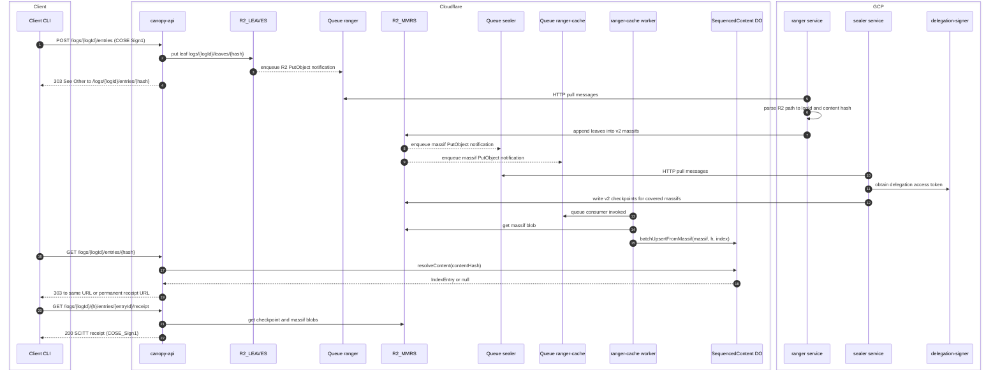

# Sequencing, latency, and throughput architecture

This document describes the current sequencing path from statement
registration to receipt.
It focuses on storage, Cloudflare queues and workers, Arbor backend
services, and where latency and throughput costs arise.
It also suggests architectural changes to reduce hops and improve
performance without weakening log or sealing robustness.

## High level components

Cloudflare side:

- `canopy-api` worker that exposes SCRAPI compatible endpoints.
- `R2_LEAVES` bucket that stores ingress leaves under
  `logs/{logId}/leaves/{sha256}`.
- `R2_MMRS` bucket that stores v2 merklelog massifs and checkpoints under
  `v2/merklelog/massifs/...` and `v2/merklelog/checkpoints/...`.
- Cloudflare Queues:
  - `{CANOPY_ID}-ranger` for leaf notifications from `R2_LEAVES`.
  - `{CANOPY_ID}-sealer` for massif notifications from `R2_MMRS`.
  - `{CANOPY_ID}-forester` for massif notifications
    used by the forester service.
  - `{CANOPY_ID}-ranger-cache` for massif notifications consumed by the
    `ranger-cache` worker.
- R2 event notifications configured by `cloudflare.yml`:
  - `R2_LEAVES` `object-create` with prefix `logs/` -> `{CANOPY_ID}-ranger`.
  - `R2_MMRS` `object-create` with prefix `v2/merklelog/massifs/` ->
    `{CANOPY_ID}-sealer`.
  - Same `R2_MMRS` prefix -> `{CANOPY_ID}-forester`.
  - Same `R2_MMRS` prefix -> `{CANOPY_ID}-ranger-cache`.
- `ranger-cache` worker
  - Queue consumer for `{CANOPY_ID}-ranger-cache`.
  - Reads massifs from `R2_MMRS`.
  - Updates a Durable Object per log.
- `SequencedContent` Durable Object
  - Keyed by `"{logId}/rangersequence"`.
  - Stores recent sequenced entries as
    `(contentHash -> {idtimestamp, mmrIndex, massifHeight})`.
  - Bounded cache with FIFO eviction.

Arbor and GCP side:

- `ranger` service
  - HTTP pull consumer of `{CANOPY_ID}-ranger` queue.
  - Appends leaves into v2 merklelog massifs in `R2_MMRS`.
- `sealer` service
  - HTTP pull consumer of `{CANOPY_ID}-sealer` queue.
  - Uses GCP Workload Identity to talk to `delegation-signer`.
  - Seals logs by writing v2 checkpoints into `R2_MMRS`.
- `delegation-signer` service
  - Issues short lived COSE signing delegation leases to `sealer`.

The forester service also receives massif notifications, but it is not
on the critical path for receipt resolution.

## End to end sequence: register statement to receipt

The following diagram shows the full happy path from `POST /entries`
through sequencing, sealing, and receipt retrieval.
It omits error branches for clarity.

### Narrative walkthrough

1.
Client runs `task scrapi:register-statement:*`.
The script generates a COSE Sign1 statement locally.
It then `POST`s to `canopy-api` at `/logs/{logId}/entries` with the
COSE payload.

2.
`registerSignedStatement` validates content type, size, and COSE
structure.
It writes the statement into `R2_LEAVES` using `storeLeaf`.
The object key is `logs/{logId}/leaves/{sha256(content)}`.
The function returns the content hash and R2 `etag`.

3.
`canopy-api` immediately returns `303 See Other` with `Location` set to
`/logs/{logId}/entries/{contentHash}`.
No explicit queue send happens in this handler.

4.
Cloudflare R2 event notifications emit an `object-create` event for the
new leaf.
That notification is delivered to the `{CANOPY_ID}-ranger` queue.

5.
The `ranger` service runs in GCP and polls the queue via HTTP.
`POLL_INTERVAL` defaults to `5s`, so message latency is bounded by that
interval plus queue and network overhead.
`QueueConsumer` unmarshals the message as `R2Notification`, then uses
`processObjectPath` to parse the key
`logs/{logId}/leaves/{hash}` into a `uuid` log id and 32 byte hash.

6.
For each log id span, `Committer.ProcessBatch` builds or resumes a v2
merklelog append context for the log.
For every message it:

- Generates a new `idtimestamp` snowflake id.
- Hashes `idtimestamp || contentHash` to get the MMR leaf value.
- Appends the leaf to the massif, rolling the massif when it fills.
- Updates the v2 trie and bloom index with `contentHash` keyed by
  `idtimestamp`.

The committer writes massifs into `R2_MMRS` using the v2 schema under
`v2/merklelog/massifs/{massifHeight}/{logId}/{massifIndex}.log`.

7.
Every new massif write triggers R2 event notifications from the
`R2_MMRS` bucket.
A single write fans out to three queues:

- `{CANOPY_ID}-sealer` for sealing.
- `{CANOPY_ID}-forester` for forester derived processing.
- `{CANOPY_ID}-ranger-cache` for cache index updates.

8.
The `sealer` service polls `{CANOPY_ID}-sealer` via HTTP with its own
`POLL_INTERVAL` (default `5s`).
For each notification it parses the massif key
`v2/merklelog/massifs/{height}/{logId}/{index}.log` to recover
`logId` and `massifHeight`.
It groups messages per log and per massif height.

9.
Before processing any batch, `sealer` acquires a delegation access token
from GCP and uses it to obtain a delegation lease from
`delegation-signer`.
This lease contains a COSE signing key and certificate bytes.

10.
`CheckpointLog` walks from the last checkpoint index up to the head
massif index for the log and height.
For each massif it:

- Reads existing checkpoints from `R2_MMRS` if present.
- Computes or checks MMR peaks and size.
- Signs a new checkpoint with the delegated key.
- Injects the delegation certificate in unprotected header label `1000`.
- Writes the checkpoint to `R2_MMRS` using optimistic concurrency with
  `If-Match` on the existing `etag`.

Thus `R2_MMRS` accumulates a sequence of checkpoints that cover more and
more of the log.

11.
In parallel, R2 massif notifications also reach the
`{CANOPY_ID}-ranger-cache` queue.
That queue has a Worker consumer configured in `ranger-cache`'s
`wrangler.jsonc`.
Cloudflare delivers batches directly to the worker without a custom poll
loop.

12.
`ranger-cache`'s queue handler validates each message body as an
`R2Notification` and filters for `PutObject` actions.
It uses `parseV2StorageObjectPath` to parse the massif key, then fetches
that massif from `R2_MMRS` via the `R2_MMRS` binding.

13.
The worker calls
`SequencedContent.batchUpsertFromMassif(massif, height, index)` on the
Durable Object for the log.
The DO:

- Enumerates leaf records directly from the massif blob.
- Computes each leaf's global MMR index based on massif height and
  index.
- Stores `(contentHash, idtimestamp, mmrIndex, massifHeight)` rows in a
  SQLite table keyed by `content_hash`.
- Evicts oldest rows by `idtimestamp` when the table exceeds capacity
  `2^(massifHeight-1)`.

14.
While the background pipeline runs, the client polls status using the
`register-statement` script.
The script repeatedly `GET`s the `Location` from the initial `303` and
examines the response `Location` header.
If the `Location` ends in `/receipt` it treats the operation as
completed.
Otherwise it sleeps and retries.

15.
Each GET of `/logs/{logId}/entries/{hash}` routes to
`queryRegistrationStatus`.
This handler resolves the Durable Object id `"{logId}/rangersequence"`,
gets a stub, and calls `resolveContent(contentHashBigint)`.
If the DO has no row for the hash yet, the handler returns `303` to the
same URL with a retry after hint.
When the DO has a row it assembles a permanent receipt URL of the form
`/logs/{logId}/{massifHeight}/entries/{entryId}/receipt`.

16.
The client then issues a `GET` of the permanent receipt URL.
`resolveReceipt` uses `mmrIndex` and `massifHeight` to derive the
massif index and object key.
It loads the checkpoint and massif blobs from `R2_MMRS` and attaches an
inclusion proof to the pre signed peak receipt contained in the
checkpoint.
It returns the assembled SCITT receipt as `application/scitt-receipt+cbor`.

## Latency critical path

The critical path for the interactive `register-statement` task is the
following chain.

1.
`POST /entries` to `canopy-api` and `R2_LEAVES` put.
This is synchronous and typically low latency.

2.
Propagation from `R2_LEAVES` to `{CANOPY_ID}-ranger` via R2 event
notifications.
This is usually fast compared to queue polling.

3.
`ranger` poll interval and processing time.
The default `POLL_INTERVAL` is `5s`.
So in the worst case the first leaf may wait almost `5s` before being
seen.
Under load the service can process up to `QUEUE_BATCH_SIZE` messages per
poll but still pays the poll interval when the queue is empty.

4.
Massif writes to `R2_MMRS`.
The cost scales with the number of leaves and massif layout but is
bounded by network and R2 throughput.

5.
Propagation of massif notifications to `{CANOPY_ID}-ranger-cache`.
Cloudflare queue to worker delivery is event driven, so additional delay
is usually small and independent of GCP.

6.
`ranger-cache` fetching massifs and updating the Durable Object.
The cost is dominated by R2 read latency and per massif enumeration.
For large massifs this may be a few milliseconds to tens of
milliseconds.

7.
Client polling of `/logs/{logId}/entries/{hash}`.
The script polls once per second by default and stops as soon as the DO
returns a hit and `canopy-api` returns a `Location` ending in
`/receipt`.

8.
Sealing and checkpointing via `sealer` and
`{CANOPY_ID}-sealer` queue.
This is *not* required for the redirect from status to permanent
receipt URL.
It is required for the final `GET /receipt` to succeed.
`sealer` has a similar `POLL_INTERVAL` default of `5s`, so a second
polling leg is added on the path to availability of the receipt.

9.
Construction of the receipt in `resolveReceipt`.
This is synchronous and dominated by two R2 reads and local CBOR
parsing.

In the happy path the latency budget is roughly:

- `O(POST + R2 put)`.
- `+ O(POLL_INTERVAL_ranger)`.
- `+ O(R2_MMRS write and notifications)`.
- `+ O(ranger-cache processing)`.
- `+ O(POLL_INTERVAL_sealer)`.
- `+ O(R2_MMRS reads for checkpoint and massif)`.

Client side retry policy may make the observed latency slightly larger,
particularly if the first `GET /receipt` is attempted before a
checkpoint exists.

## Throughput and robustness characteristics

Current design properties that are good for robustness and scale.

- All durable state of the log is in `R2_MMRS`.
  Massifs and checkpoints together let you recompute the log and
  receipts independent of queues or workers.
- Ingress writes use content addressed keys and are create only within
  the TTL window.
  Duplicate statements are naturally de duplicated until the leaf
  expires.
- R2 event notifications remove the need for explicit queue send code in
  `canopy-api`.
  This reduces failure surface area in the ingest path.
- Cloudflare Queues decouple workloads across vendors.
  Back pressure on `ranger` or `sealer` does not affect `canopy-api`
  directly.
- `ranger-cache` derives its index exclusively from massifs.
  If the DO state is lost it can, in principle, be rebuilt from
  `R2_MMRS` using the same `batchUpsertFromMassif` logic.
- `sealer` uses optimistic concurrency on checkpoints.
  This allows multiple instances to race safely and ensures
  monotonicity of the MMR state persisted in R2.

These choices trade some latency for simpler failure modes and high peak
throughput.

## Opportunities to remove or streamline links

This section focuses on concrete hops you might remove or change.

### 1.
Adaptive polling for `ranger` and `sealer`

Today both `ranger` and `sealer` use a fixed `POLL_INTERVAL` of
`5s`.
This heavily dominates receipt latency under light to moderate load.

A low impact change is to make polling adaptive.
Possible strategy:

- If a pull returns `>0` messages or a large backlog count,
  immediately issue another pull without waiting for the full
  interval.
- If a pull returns `0` messages and backlog `0`, back off
  exponentially up to a ceiling (for example `5s`).
- Under sustained load the services would run close to
  continuous pulls, keeping latency low while still bounding
  idle cost.

This change operates entirely inside the existing queue
infrastructure and does not change failure modes.

### 2.
Queue between R2 massifs and `ranger-cache`

The pipeline from massifs to the Durable Object is:

- `R2_MMRS` write.
- R2 event notification -> `{CANOPY_ID}-ranger-cache`.
- Queue batch delivery to `ranger-cache` worker.
- Massif read from `R2_MMRS`.
- DO update via `batchUpsertFromMassif`.

The queue here is largely intrinsic to R2 event notifications.
Cloudflare currently exposes R2 notifications via queues, and the
Worker consumer is the idiomatic way to hook a Durable Object in.
There is not much you can remove without changing the event
mechanism itself.

However you *could* bypass R2 notifications entirely for the
`ranger-cache` path and feed the DO from `ranger` instead.
A possible design would be:

- Extend `Committer.ProcessBatch` to emit a `SequenceRecord` per
  leaf `(logId, contentHash, idtimestamp, mmrIndex, massifHeight)`.
- Send those records to a dedicated Cloudflare queue with a
  Worker consumer that writes directly into `SequencedContent`.
- Keep the existing R2 notification path for `sealer` and
  `forester` only.

Pros:

- Removes one R2 notification hop for the registration status
  cache.
- Removes an R2 read per massif for `ranger-cache`.
- DO updates can happen as soon as `ranger` commits a massif
  locally, which may be slightly earlier than when R2 finishes
  writing massifs and dispatching notifications.

Cons and risks:

- The DO becomes a view that is no longer purely derived from
  `R2_MMRS`.
- You gain another queue with its own delivery semantics to
  monitor.
- You must be careful that DO updates are idempotent and match
  the eventual massif layout, or add reconciliation logic.

Given that registration status is a cache and not the source of
truth, this trade can be acceptable if you want to shave more
latency off the polling loop.
It does increase implementation complexity.

### 3.
Client side polling strategy

The `register-statement` Taskfile currently:

- Polls `/logs/{logId}/entries/{hash}` once per second until it
  sees a `Location` ending with `/receipt`.
- Immediately calls `GET /receipt` once and fails hard if that
  call returns an error.

If `ranger-cache` has caught up but `sealer` has not yet written
its checkpoint, this can fail with a transient
"checkpoint missing" problem that the client does not retry.

You can make the long tail more robust and predictable by:

- Treating specific storage related `4xx` or `5xx` errors from
  `resolveReceipt` as transient and retrying for a bounded
  period.
- Returning a `202 Accepted` style CBOR body from
  `resolveReceipt` for the not yet sealed case, instead of a
  generic `404`, with a `Retry-After` hint.

This does not remove a network hop but avoids having
receipt resolution fail purely because `sealer` is a little
behind `ranger-cache`.

### 4.
Forester and derived processing queue

Massif notifications fan out to a separate forester queue.
If forester work is mostly derived reporting or async export, you
could:

- Consider moving forester processing off the hot path by having
  it read from a durable log of checkpoints instead of raw
  massifs.
- Or share the sealer queue and branch on object key prefix so
  you do not pay for a third separate queue.

This will not reduce registration to receipt latency, but it can
shrink background load and simplify operations at high scale.

## Where Cloudflare or GCP could be used more effectively

This section discusses more structural changes that may be worth
exploring.
They are higher cost but potentially large wins for latency and
operational simplicity.

### Option A.
Move ranger like functionality closer to Cloudflare

Today `ranger` runs in GCP, polls a Cloudflare queue, and writes
back to Cloudflare R2.
Each step crosses provider and region boundaries.

Potential improvements:

- Implement a lightweight append only merklelog writer as a
  Cloudflare Worker that consumes `{CANOPY_ID}-ranger` directly.
- Use `R2_MMRS` as the only storage, with Workers using the same
  massifs format as Arbor.
- Keep sealer in GCP if needed, but consider moving sealing into
  a Worker with a hardware key or Cloudflare managed KMS if
  trust and compliance allow it.

Benefits:

- Eliminates GCP <-> Cloudflare round trips for ingestion.
- Removes the need for an HTTP pull consumer for the ranger
  queue.
- Simplifies network and credential configuration.

Costs and risks:

- Significant rewrite of `ranger` from Go to JavaScript or
  TypeScript targeting Workers.
- Need to re validate performance of merklelog operations under
  Workers constraints and R2 bandwidth.
- If you rely on GCP specific security controls for the sealing
  boundary, moving that logic may be non trivial.

### Option B.
Leverage GCP Pub/Sub for internal fan out

On the GCP side you might choose to decouple Cloudflare ingress
from internal processing via Pub/Sub:

- Have a small GCP edge service that consumes the Cloudflare
  queues and republishes messages into Pub/Sub topics.
- Run `ranger`, `sealer`, and forester instances that subscribe
  to those topics.

Benefits:

- Scales internal processing with familiar GCP primitives.
- Lets you control retry policies, dead letter queues, and
  observability with Pub/Sub tooling.

Costs:

- Adds another queue hop, which only makes sense if internal
  scale or management trumps latency.
- Does not remove Cloudflare queues, so this is mostly an
  operational improvement, not a hop reduction.

### Option C.
Tighten Cloudflare side storage locality

`ranger-cache` currently reads full massifs from `R2_MMRS` to
populate `SequencedContent`.
This is robust because the DO is always consistent with persisted
massifs, but it is somewhat heavy.

You could investigate:

- Persisting a compact `SequenceRecord` stream in a separate
  R2 prefix or Cloudflare KV from `ranger`.
- Having `ranger-cache` index from that stream instead of
  reading massifs.

This is similar to the earlier queue suggestion but uses storage
rather than a new queue.
It may simplify re indexing and avoid re reading large massifs
just to update a small cache.

## Overall suitability and recommendations

Overall the architecture is sound for a transparency log that
prioritises correctness and recoverability.
It has these strengths:

- Ground truth is in append only R2 massifs and signed
  checkpoints.
- Ingress is decoupled from sequencing and sealing by queues.
- Registration status is served from a bounded Durable Object
  cache, avoiding hot paths through the merklelog code.
- Sealing is isolated into a dedicated service with a clear trust
  boundary to GCP Workload Identity and delegation signer.

The main trade off is higher user perceived latency due to two
queue polling legs and background sealing.
Given your goal of maximising throughput and minimising latency
while preserving robustness, the near term recommendations are:

1.
Implement adaptive polling in both `ranger` and `sealer` based
on backlog, so that under load they effectively run in
streaming mode while backing off when idle.

2.
Relax the `register-statement` client script to tolerate
transient `resolveReceipt` failures and retry receipt resolution
for a short bounded window.
This removes sharp edges around the long tail of sealer delay
without changing server side semantics.

3.
Consider introducing a dedicated sequence update path from
`ranger` to `ranger-cache` via a new queue or compact R2 stream.
Use that as the primary source for `SequencedContent`, while
keeping massif based re indexing logic for recovery.
This can reduce both latency and R2 read load for the status
cache.

4.
If you later find that the GCP <-> Cloudflare boundary is a
major contributor to latency or operational complexity, evaluate
moving the merklelog append and possibly sealing closer to
Cloudflare, either as Workers or as services running in
Cloudflare connected compute.

Taken together these changes should give you a more responsive
register to receipt flow while preserving the strong durability
properties of your current v2 merklelog and sealing design.
