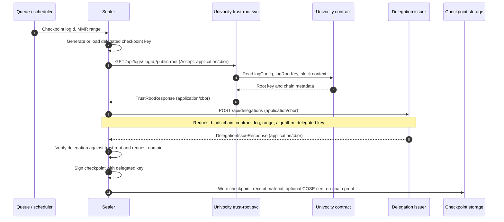
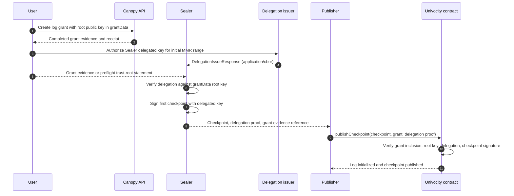
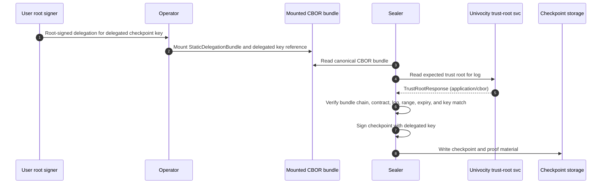
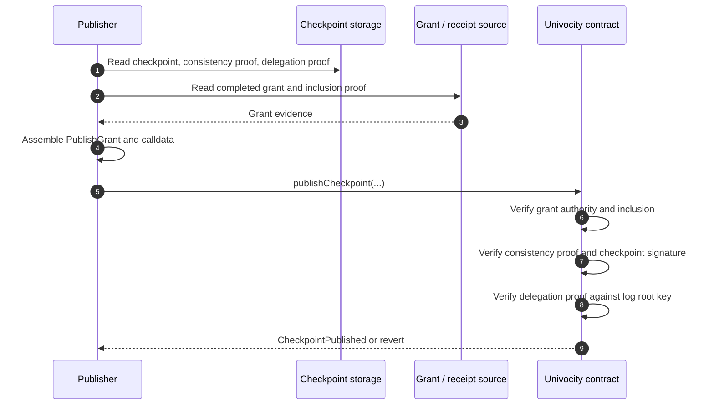

# Plan 0003: Non-custodial checkpoint support

## Goal

Add a non-custodial checkpointing path where a user can establish a log with
their own root key, keep that root private key outside Arbor, and authorize
Arbor Sealer only through bounded checkpoint-signing delegations.

The target model:

1. User supplies the log root public key in the log-creation grant's
   `grantData`.
2. User keeps the root private key outside Arbor.
3. Sealer generates or is given a checkpoint signing public key.
4. Sealer asks a **delegation issuer** for a root-key-signed delegation.
5. Sealer independently verifies that delegation against a trust root read from
   Univocity contract state, or from `grantData` for first-checkpoint cases.
6. Sealer signs checkpoints using the delegated checkpoint key.
7. A publisher submits checkpoint evidence on-chain.

Arbor must never need the user root private key. The transaction publisher key
remains unrelated to log authority.

## Core Decision

Sealer should stop depending on "Custodian" as a trusted authority. Instead it
should depend on two explicit services:

1. **Univocity trust-root service**: a read proxy for contract state, used to
   learn the chain-derived log root key and log configuration.
2. **Delegation issuer service**: a proof source that returns delegations for
   Sealer's checkpoint signing key.

Custodian may implement the delegation issuer API, but Sealer should not know
or care that the issuer is Custodian. Sealer must verify every delegation it
receives against the expected log root key before signing or writing a
checkpoint.

```text
                      +----------------------------+
                      | Univocity contract / chain |
                      +-------------+--------------+
                                    ^
                                    | read state
                           +--------+--------+
                           | Univocity svc   |
                           | trust roots     |
                           +--------+--------+
                                    ^
                                    | log root key, config
+--------+      delegation request  +--------+      signed delegation
| Sealer +------------------------->| Issuer +------------------+
+---+----+                          +--------+                  |
    |                                                           |
    | verify issuer response against trust root                 |
    v                                                           |
checkpoint signed with verified delegated key <----------------+
```

## Current State

Sealer already has most checkpoint-signing mechanics:

- `CheckpointLog` creates checkpoints from R2-backed massif state.
- `DelegationLeaseManager` caches per-log delegation leases.
- `RequestLogDelegationLease` generates an ephemeral delegated key locally,
  asks Custodian to sign a delegation for `(logId, mmrStart, mmrEnd,
  delegatedKey)`, and returns both the certificate and delegated private key.
- Sealer embeds the delegation certificate in the checkpoint unprotected header.

The current dependency is too specific:

```text
Sealer -> Custodian -> delegation signed by custody/root key
```

The desired dependency is:

```text
Sealer -> Univocity trust-root service -> expected root key
Sealer -> Delegation issuer -> candidate delegation
Sealer -> local verification -> usable delegation lease
```

Custodian becomes one possible delegation issuer implementation, not a
privileged authority in Sealer's model.

## Non-goals

- Do not put user root private keys in Arbor config, Kubernetes secrets, or
  Sealer memory for the production non-custodial path.
- Do not make the checkpoint publisher key authoritative.
- Do not require Univocity contracts to parse full COSE delegation
  certificates.
- Do not require per-log delegation issuer endpoints.
- Do not remove the existing custodial deployment path.

## Authority Model

### Root key establishment

The log root key is established when the log is created:

- `grantData` contains the root public key bytes for the new log.
- Univocity stores that key as the log root key at the first checkpoint.
- Later checkpoints must be signed by that root key or by a delegated key
  authorized by it.

For a non-custodial log, the user controls that root key. Arbor only receives
bounded delegations to checkpoint signer keys.

### Three separate keys

- Log root key: held by the user or Custodian, depending on log mode. It
  authorizes checkpoint signer delegations.
- Checkpoint signer key: held by Sealer or a remote signing service. It signs
  checkpoint receipts.
- Transaction publisher key: held by the publisher service. It pays gas and
  submits `publishCheckpoint`; it is not log authority.

The contract's enforcement point is the root/delegation signature chain, not
the transaction sender.

### First-checkpoint trust root

For initialized logs, Sealer resolves the trust root from the Univocity service,
which reads the contract:

- `logConfig(logId)`
- `logRootKey(logId)`
- `isLogInitialized(logId)`

For an uninitialized log's first checkpoint, there is no on-chain log root yet.
The expected root key comes from the log-creation grant's `grantData`. The
publisher path must carry that grant evidence; Sealer can only fully validate
first-checkpoint delegations when it has the grant or a preflight trust-root
statement derived from that grant.

## Service Interfaces

### Encoding profile

Use CBOR from the first implementation for new Sealer-facing service APIs.
This matches the existing internal service direction:

- Custodian requires `Content-Type: application/cbor` for structured request
  bodies and writes `application/cbor` responses.
- Custodian writes `application/problem+cbor` for structured errors.
- Scout writes CBOR for structured service responses.
- Ranger's ingress queue client sends CBOR request bodies.
- Canopy SCRAPI responses are CBOR-first, with only health/config endpoints as
  JSON exceptions.

The generic delegation issuer API and new trust-root client responses should
therefore use:

- `Content-Type: application/cbor` for successful request and response bodies.
- `Accept: application/cbor` on Sealer client requests.
- `Content-Type: application/problem+cbor` for problem details.
- Canonical CBOR encoding for request and response maps.
- CBOR byte strings for public keys, protected headers, certificates,
  signatures, and proof bytes. Do not base64-wrap binary fields on the wire.

The current Univocity service reads contract state through JSON endpoints. This
plan should move the Sealer trust-root path to CBOR as part of the same work,
while preserving JSON only if needed for human/debug compatibility.

### Trust-root service

The existing `services/univocity` service is the right home for the trust-root
reader. It should be treated as a chain-state proxy, not as a delegation
authority.

Suggested endpoints:

- `GET /api/root`: root contract initialization state.
- `GET /api/logs/{logId}/config`: log kind, owner/auth log, and
  initialization state.
- `GET /api/logs/{logId}/public-root`: root public key for initialized logs.
- `GET /api/chain`: chain id, contract address, and latest safe/finalized block
  metadata.

Trust-root responses should include enough metadata for freshness checks. The
wire format is CBOR; this Go shape shows the intended map keys:

```go
type TrustRootResponse struct {
    ChainID         string `cbor:"chainId"`
    ContractAddress string `cbor:"contractAddress"`
    BlockNumber     uint64 `cbor:"blockNumber"`
    BlockHash       []byte `cbor:"blockHash"`
    Finality        string `cbor:"finality"`
    LogID           []byte `cbor:"logId"`
    Kind            string `cbor:"kind"`
    OwnerLogID      []byte `cbor:"ownerLogId,omitempty"`
    RootKey         struct {
        Alg string `cbor:"alg"`
        X   []byte `cbor:"x"`
        Y   []byte `cbor:"y"`
    } `cbor:"rootKey"`
}
```

Sealer should cache trust roots with a short TTL and fail closed on mismatch,
stale data, or missing root for initialized logs.

### Delegation issuer service

Sealer should call a generic delegation issuer endpoint:

```text
POST /api/delegations
```

Request:

```go
type DelegationIssueRequest struct {
    Version             uint64 `cbor:"version"`
    Domain              string `cbor:"domain"`
    ChainID             string `cbor:"chainId"`
    ContractAddress     string `cbor:"contractAddress"`
    LogID               []byte `cbor:"logId"`
    MMRStart            uint64 `cbor:"mmrStart"`
    MMREnd              uint64 `cbor:"mmrEnd"`
    Algorithm           string `cbor:"algorithm"`
    DelegatedPublicKey  []byte `cbor:"delegatedPublicKey"`
    RequestedTTLSeconds uint64 `cbor:"requestedTtlSeconds"`
    RequestID           []byte `cbor:"requestId"`
}
```

Response:

```go
type DelegationIssueResponse struct {
    Version     uint64                  `cbor:"version"`
    IssuedAt    int64                   `cbor:"issuedAt"`  // Unix seconds.
    ExpiresAt   int64                   `cbor:"expiresAt"` // Unix seconds.
    Certificate []byte                  `cbor:"certificate,omitempty"`
    OnchainProof OnchainDelegationProof `cbor:"onchainProof"`
}

type OnchainDelegationProof struct {
    ProtectedHeader []byte `cbor:"protectedHeader"`
    DelegationKey   []byte `cbor:"delegationKey"`
    MMRStart        uint64 `cbor:"mmrStart"`
    MMREnd          uint64 `cbor:"mmrEnd"`
    Signature       []byte `cbor:"signature"`
}
```

Problem responses should use the same problem detail shape as other services,
encoded as `application/problem+cbor`.

### Delegation issuer implementations

- `custodian`: current custodial path; signs with a local KMS-backed root key it
  controls.
- `external-http`: user-operated root-key signer behind a generic delegation
  API.
- `static`: mounted proof material for non-custodial logs.
- `wallet`: interactive or remote wallet signing flow.
- `direct`: development-only path that signs directly with configured root
  material.

Sealer only sees the generic issuer API. The issuer may be implemented by
Custodian, but its response is still verified cryptographically by Sealer.

## Sealer Responsibilities

Sealer keeps responsibility for:

- selecting or generating the delegated checkpoint signing key;
- asking the trust-root service for the expected log root key;
- asking the delegation issuer for a delegation;
- verifying the issuer response against the expected root key;
- verifying the delegation binds the requested log, range, domain, contract,
  chain, algorithm, and delegated public key;
- signing checkpoints with the verified delegated key;
- embedding optional off-chain delegation certificate material in checkpoints;
- exposing on-chain proof material for the Univocity publisher.

Sealer must not:

- trust the issuer endpoint name as authority;
- treat HTTP authentication as log authority;
- accept a delegation for a different delegated key;
- accept a delegation for a different chain/contract/log/range;
- write checkpoints using an unverified lease.

## Key Flow Diagrams

### Initialized log checkpointing

For an initialized log, Sealer treats Univocity as the source of the expected
root key and treats the issuer as an untrusted source of candidate delegation
material.



### First-checkpoint bootstrap

For the first checkpoint of a not-yet-initialized log, the expected root key is
not yet available from `logRootKey(logId)`. It comes from the log-creation
grant's `grantData`, and the publisher must carry the grant evidence into the
first `publishCheckpoint` call.



### Static non-custodial delegation

Static mode is the first useful non-custodial path because it does not require a
live user signing service. The mounted bundle should use the same canonical CBOR
shape as issuer responses.



### Publishing a delegated checkpoint

The publisher key pays for the transaction only. Contract acceptance depends on
the grant, consistency proof, delegation proof, and checkpoint signature.



## Canopy API Surface Implications

Canopy already has most of the raw grant surface needed for non-custodial log
creation:

- Forestrie-Grant v0 treats `grantData` as committed opaque bytes.
- `POST /register/{bootstrap-logid}/grants` accepts a caller-supplied
  transparent statement rather than minting the grant server-side.
- The root bootstrap branch verifies the grant COSE signature against
  `grantData` and checks that those bytes match the forest genesis public key.
- Child auth/data first-grant paths already use `grantData` as the public key
  or signer binding for the new target capability.
- `POST /api/forest/{log-id}/genesis` and `GET /api/forest/{log-id}/genesis`
  already store and expose CBOR genesis key material.

That means Canopy does **not** need a fundamental redesign to let a user create
a log whose root private key stays outside Arbor. A non-custodial user can
produce the grant payload, sign it with the root key, and submit the resulting
transparent statement to the existing register-grant route.

There are still API extensions and cleanups needed to make this a complete
product surface.

### Clarify grantData profiles

The current `grantData` bytes are intentionally opaque, but non-custodial
support needs documented profiles so Canopy, Sealer, Publisher, and Univocity
interpret the same bytes:

- `log-root-es256-xy`: 64-byte P-256 `x || y` for root or child authority log
  creation.
- `statement-signer-es256-xy`: 64-byte P-256 `x || y` for data-log statement
  registration grants.
- Future `log-root-es256k-xy` or COSE_Key-shaped profiles only if Univocity and
  receipt verification support them end-to-end.

The grant wire format can remain unchanged. The improvement is to add named
helpers, validation messages, and tests so `grantData` is not treated as
Custodian-specific `x || y` by convention only.

### Replace Custodian-only receipt verification

This is the required API-side extension for non-custodial logs.

Today Canopy receipt authorization resolves the receipt verification key through
Custodian's curator/log-key API. That works when Custodian is the root key
holder. It does not work when Sealer receipts are signed by delegated
non-custodial checkpoint keys.

Canopy should replace the Custodian-specific resolver with a generic receipt
authority resolver:

1. Read the owner log trust root from the Univocity trust-root service.
2. Extract the delegation certificate or on-chain-shaped delegation proof from
   the receipt/checkpoint headers.
3. Verify the delegation against the owner log root key.
4. Verify the receipt COSE Sign1 using the delegated checkpoint key.
5. Fall back to direct root-key receipt verification only when no delegation is
   present and direct root signing is allowed for that log.

Custodian-backed deployments can remain one resolver implementation, but
`register-grant` and `register-signed-statement` should depend on the generic
resolver, not on Custodian.

### Add a grant-authoring convenience surface

The current API is intentionally low-level: clients must construct the grant
CBOR payload, sign it, wrap it as a transparent statement, submit it, poll
status, fetch the receipt, and attach receipt/idtimestamp to form the completed
grant artifact.

That is acceptable for tests and SDKs, but user-facing non-custodial creation
would benefit from a Canopy helper surface that never sees private keys:

- `POST /api/grants/prepare`: accept the intended grant fields and return the
  canonical CBOR payload, grant commitment hash, and signing instructions.
- `POST /register/{bootstrap-logid}/grants`: remain the canonical submission
  route for the signed transparent statement.
- `GET /logs/{bootstrap}/{ownerLogId}/entries/{entryId}/grant`: optionally
  return a completed transparent grant artifact, so users and publishers do not
  have to reconstruct it client-side from the original grant plus receipt.

The helper endpoint is not authority. It only reduces encoding mistakes and
makes non-custodial clients easier to build.

### Keep genesis admin-scoped unless roots become self-service

`POST /api/forest/{log-id}/genesis` is currently curator-admin scoped. That is
appropriate for establishing the forest bootstrap root. For user-created
non-custodial logs, prefer child authority logs under an already bootstrapped
forest root instead of making forest genesis self-service.

If the product needs multiple user-owned root logs at the same level as forest
genesis, add a separate public or authenticated "root-log intent" flow rather
than weakening the existing curator-only genesis route.

### Canopy acceptance criteria

- A user can create a non-custodial root/authority grant using a local key and
  submit it through existing `register-grant` semantics.
- Canopy authorization no longer assumes Custodian is the receipt root key
  resolver.
- Completed grant artifacts can be recovered through a stable API or SDK helper.
- Tests cover Custodian-backed and non-custodial grantData profiles.
- Tests cover receipt verification through a root-key delegation path that does
  not call Custodian.

## Delegation Artifacts

Use two related artifacts when necessary:

1. **Off-chain certificate**: a COSE delegation certificate for receipts,
   diagnostics, and public audit.
2. **On-chain proof**: a compact Univocity delegation proof, preferably using
   COSE Sign1 `Sig_structure` semantics as described in Univocity ADR-0006.

Sealer may embed the off-chain certificate in checkpoints while also storing or
exposing the on-chain proof for the publisher.

The internal lease should be semantic, not byte-format-specific:

```go
type DelegationLease struct {
    CertBytes []byte // optional off-chain COSE certificate

    OnchainProof *OnchainDelegationProof

    Curve      delegationcert.Curve
    PrivateKey *ecdsa.PrivateKey
    PublicKey  *ecdsa.PublicKey

    IssuedAt  time.Time
    ExpiresAt time.Time
}

type OnchainDelegationProof struct {
    ProtectedHeader []byte
    DelegationKey   []byte
    MMRStart        uint64
    MMREnd          uint64
    Signature       []byte
}
```

## Configuration

Replace Custodian-specific Sealer configuration with explicit trust-root and
delegation issuer configuration. Custodian-specific values are issuer
implementation details.

- `UNIVOCITY_TRUST_ROOT_URL`: base URL of the Univocity chain-state proxy.
- `UNIVOCITY_CHAIN_ID`: expected chain id; responses must match.
- `UNIVOCITY_CONTRACT_ADDRESS`: expected contract address; responses and
  delegation payloads must match.
- `DELEGATION_ISSUER_URL`: base URL of the generic delegation issuer.
- `DELEGATION_ISSUER_TOKEN`: optional bearer token for issuer access; log only
  blinded hash.
- `DELEGATION_KEY_CURVE`: delegated checkpoint key curve; default
  `secp256r1`.
- `DELEGATION_KEY_STRATEGY`: `ephemeral`, `static`, or future `remote`.
- `DELEGATION_STATIC_PATH`: static issuer mounted proof/key material.
- `DELEGATION_LEASE_TTL`: requested lease TTL where issuer supports fresh
  leases.
- `DELEGATION_RENEW_BEFORE`: renewal guard before checkpointing starts.

Custodian deployments can satisfy `DELEGATION_ISSUER_URL` with a Custodian
endpoint that implements the generic delegation API.

Validation rules:

- `UNIVOCITY_TRUST_ROOT_URL`, `UNIVOCITY_CHAIN_ID`, and
  `UNIVOCITY_CONTRACT_ADDRESS` are required for any publishing-aware mode.
- `DELEGATION_ISSUER_URL` is required unless using static mounted proofs.
- `DELEGATION_ISSUER_TOKEN` is optional but must never be logged raw.
- `DELEGATION_KEY_CURVE` must match Univocity-supported delegation algorithms.
- Static proof mode requires `DELEGATION_STATIC_PATH`.
- Direct mode, if kept, requires an explicit `DELEGATION_DIRECT_ENABLE=1` guard
  and must not be present in production overlays.

## Implementation Phases

### Phase 1: Introduce trust-root client

Add a Sealer-side client for the Univocity trust-root service.

Interface sketch:

```go
type TrustRootClient interface {
    LogSigningKey(ctx context.Context, logIDHex string) (*LogSigningKey, error)
    LogConfig(ctx context.Context, logIDHex string) (*LogConfig, error)
    ChainContext(ctx context.Context) (*ChainContext, error)
}

type LogSigningKey struct {
    LogIDHex        string
    Alg             string
    X               []byte
    Y               []byte
    ChainID         string
    ContractAddress string
    BlockNumber     uint64
    BlockHash       string
    Finality        string
}
```

Acceptance criteria:

- Sealer can fetch and cache a root key for an initialized log.
- Sealer fails closed on wrong chain id or contract address.
- Sealer sends `Accept: application/cbor` and decodes `application/cbor`
  responses.
- Trust-root service failures use `application/problem+cbor`.
- Responses include block metadata and are logged without key material beyond
  public-key fingerprints.

### Phase 2: Extract delegation issuer interface

Refactor `DelegationLeaseManager.EnsureValidForLog` so it no longer calls
`RequestLogDelegationLease` directly.

Target shape:

```diff
 type DelegationLeaseManager struct {
     mu          sync.Mutex
     leases      map[string]*list.Element
     lru         *list.List
     maxLeases   int
     ttl         time.Duration
     renewBefore time.Duration
+    issuer      DelegationIssuer
+    trustRoots  TrustRootClient
 }
```

```diff
- lease, err := RequestLogDelegationLease(
-     ctx, httpClient, custodianURL, appToken, curve, m.ttl,
-     logIdHex, mmrStart, mmrEnd,
- )
+ root, err := m.trustRoots.LogSigningKey(ctx, logIdHex)
+ if err != nil { return nil, err }
+ lease, err := m.issuer.LeaseForLog(ctx, DelegationRequest{
+     LogIDHex:        logIdHex,
+     MMRStart:        mmrStart,
+     MMREnd:          mmrEnd,
+     Curve:           curve,
+     DelegatedKey:    delegatedPublicKey,
+     RequestedTTL:    m.ttl,
+     ChainID:         root.ChainID,
+     ContractAddress: root.ContractAddress,
+ })
+ if err != nil { return nil, err }
+ if err := VerifyDelegationLease(root, lease); err != nil { return nil, err }
```

Acceptance criteria:

- Existing Custodian-backed behavior is preserved via a generic issuer
  implementation.
- Sealer logs issuer name and non-secret lease metadata.
- Sealer verifies each lease before caching it.

### Phase 3: Separate delegated key generation from issuance

Today `RequestLogDelegationLease` generates the delegated private key and then
asks Custodian to sign a delegation for the public key.

Split this into:

1. `DelegatedKeyFactory`: creates or loads the delegated checkpoint signer.
2. `DelegationIssuer`: authorizes the public key for a log/range.

Initial key strategies:

- `ephemeral`: current behavior; Sealer generates a short-lived delegated key.
- `static`: operator supplies a delegated checkpoint key.
- `remote`: future strategy where Sealer never gets delegated private key and
  calls a remote signer for checkpoint signatures.

Acceptance criteria:

- Default remains ephemeral delegated keys.
- Static signer mode verifies public/private key pairing.
- Future remote signer mode can fit without changing issuer semantics.

### Phase 4: Generic issuer over HTTP

Implement an HTTP issuer client for `DELEGATION_ISSUER_URL`.

It should:

- send the chain id, contract address, log id, MMR range, algorithm, and
  delegated public key as canonical CBOR with `Content-Type:
  application/cbor`;
- accept `application/cbor` response bodies containing off-chain certificate
  and on-chain proof byte strings;
- decode `application/problem+cbor` failures;
- verify the returned delegation against the trust root before returning a
  lease;
- classify 4xx as permanent request/policy failure and 5xx as retryable;
- never log raw tokens, signatures, certs, or private keys.

Custodian can implement this generic API as the first server-side issuer.

Acceptance criteria:

- Sealer can obtain a delegation from a Custodian-backed generic issuer.
- Sealer has no Custodian-specific code path in checkpointing logic.
- A fake issuer returning a delegation for the wrong key/log/range is rejected.

### Phase 5: Static issuer

Implement static mounted delegation material for environments where a user wants
to pre-provision delegations outside Arbor.

Input file format should be explicit and deterministic. Prefer canonical CBOR
for mounted proof bundles too, so static mode exercises the same decoding and
byte-field handling as the HTTP issuer:

```go
type StaticDelegationBundle struct {
    ChainID                string                  `cbor:"chainId"`
    ContractAddress        string                  `cbor:"contractAddress"`
    LogID                  []byte                  `cbor:"logId"`
    MMRStart               uint64                  `cbor:"mmrStart"`
    MMREnd                 uint64                  `cbor:"mmrEnd"`
    ExpiresAt              int64                   `cbor:"expiresAt"`
    DelegatedPrivateKeyRef string                  `cbor:"delegatedPrivateKeyRef"`
    Certificate            []byte                  `cbor:"certificate,omitempty"`
    OnchainProof           OnchainDelegationProof  `cbor:"onchainProof"`
}
```

Acceptance criteria:

- Sealer can checkpoint a log using static non-custodial material.
- Missing, expired, wrong-log, wrong-contract, wrong-chain, or wrong-key
  material fails safely.
- Queue messages are not acked when checkpointing cannot obtain a valid lease.

### Phase 6: Univocity publisher integration

The non-custodial path becomes useful when checkpoints are published on-chain.
The publisher needs:

- checkpoint consistency proof data from Arbor storage;
- grant inclusion proof and completed grant evidence;
- on-chain delegation proof from the verified lease;
- `PublishGrant` fields matching the grant committed in Canopy/Univocity.

Keep publisher authority separate:

- publisher key pays gas only;
- Sealer checkpoint signer signs checkpoint only;
- log root key signs delegation only;
- user root private key never enters Arbor.

Acceptance criteria:

- Publisher can publish a checkpoint whose root key came from `grantData`.
- Contract accepts when delegation proof is valid.
- Contract rejects wrong root key, wrong delegated key, wrong log id, wrong
  range, or wrong chain/contract domain.

### Phase 7: Direct mode for development only

Add direct mode only if it materially improves local tests.

Rules:

- require `DELEGATION_DIRECT_ENABLE=1`;
- never enable in production overlays;
- log loudly that direct mode is active;
- never print private key material.

This mode signs checkpoints directly with configured root material or signs
delegations locally. It is not the production non-custodial model.

## Security Concerns

### Rogue delegation issuer returns invalid proof

Concern: a malicious or misconfigured issuer returns a proof that is not signed
by the log root key.

Mitigation:

- Sealer verifies every delegation against the expected root key before use.
- The publisher and contract verify the same proof again on publication.
- Invalid issuer responses fail closed and should not ack queue messages.

### Rogue issuer returns proof for an attacker-controlled delegated key

Concern: issuer returns a valid-looking delegation for a key other than
Sealer's checkpoint signing key.

Mitigation:

- Sealer includes its delegated public key in the request.
- Sealer verifies response `delegationKey` exactly equals the requested key.
- Sealer rejects mismatched key material before checkpoint signing.

### Stale or malicious trust-root proxy response

Concern: the Univocity service returns an old or wrong root key. This should not
allow on-chain poisoning, but can cause Sealer to waste work or sign invalid
checkpoints.

Mitigation (future work; not implemented in the current slice):

- Trust-root responses already define `chainId`, `contractAddress`,
  `blockNumber`, `blockHash`, and finality as wire fields (omitempty
  placeholders). Today no signer or verifier consumes them.
- Sealer is intended to check chain id and contract address, and to reject
  stale responses beyond a freshness window. The current implementation
  does not yet wire either check.
- High-value deployments may query multiple RPC/proxy sources.
- Publisher and contract remain final enforcement.

The eventual cryptographic binding of chain provenance is most likely to
flow through the public log data rather than through transport-only wire
fields, so the eventual implementation may obtain `chainId` /
`contractAddress` from log data itself and treat the trust-root proxy as
purely a public-key oracle.

### Replay across chains or contract deployments

Concern: a delegation for one deployment is reused on another.

Mitigation (future work; not implemented in the current slice):

- Delegation payload will bind `chainId` and `contractAddress` once the
  binding direction is decided (log-data-embedded vs signed-into-cert).
- The `DelegationIssueRequest` wire shape already reserves `domain`,
  `chainId`, `contractAddress` as omitempty fields for this purpose;
  Sealer's internal types do not carry them today and the COSE
  to-be-signed payload does not include them.
- Contract-side proof format should include the same domain fields where
  feasible.

### Over-broad delegation range

Concern: a delegated signer can sign too many checkpoints if a lease covers an
unbounded or long-lived range.

Mitigation:

- Prefer MMR ranges aligned to planned checkpoint/massif progress.
- Enforce maximum TTL and maximum range in issuer policy.
- Sealer rejects leases whose range is larger than configured policy.
- Expose lease expiry/range metrics.

### User root signer compromise

Concern: the user's root-signing service is compromised and signs arbitrary
delegations.

Mitigation:

- This is a root-authority compromise for that log; no downstream component can
  fully repair it.
- Use short TTLs, narrow ranges, hardware-backed signing, audit logs, and
  explicit policy in the user's issuer.
- Consider future revocation or root-rotation designs separately.

### Endpoint authentication confusion

Concern: operators mistake HTTP authentication to an issuer for log authority.

Mitigation:

- Document that endpoint auth is only access control/rate limiting.
- Cryptographic verification against the log root key is mandatory.
- Sealer code should name concepts `DelegationIssuer` and `TrustRootClient`,
  not `Custodian`.

### Poisoned off-chain checkpoint objects

Concern: Sealer writes checkpoints that cannot publish on-chain because it used
bad delegation material.

Mitigation:

- Verify delegation before writing checkpoint objects.
- Add integration tests that publish Sealer-produced checkpoints to a dev
  Univocity contract.
- Mark invalid issuer/proof failures as retryable or permanent according to
  cause, but do not ack successful checkpointing unless the checkpoint is valid.

## Test Plan

### Unit tests

- Trust-root client validates chain id and contract address.
- Trust-root cache expires stale responses.
- Trust-root and issuer clients require `application/cbor` success responses and
  decode `application/problem+cbor` errors.
- Generic issuer client request/response validation.
- Custodian-backed generic issuer remains compatible with current behavior.
- Static issuer validates log id, chain id, contract address, range, expiry,
  and delegated key.
- Lease manager caching works across issuer types.
- Expiring leases are renewed or rejected before checkpointing starts.

### Integration tests

- Sealer checkpoints with Custodian-backed generic issuer.
- Sealer checkpoints with static non-custodial issuer.
- Sealer rejects fake issuer responses signed by the wrong key.
- Publisher consumes on-chain proof and submits to a local Univocity contract.
- Contract rejects wrong chain/contract/log/range/delegated-key variants.

### Security tests

- Wrong delegated private key fails before checkpoint signing.
- Proof for wrong log is rejected.
- Proof outside MMR range is rejected.
- Expired proof is rejected.
- Delegation issuer token is never logged raw.
- Trust-root service mismatch fails closed.

## Operational Notes

### Custodial logs

Custodian implements the generic delegation issuer endpoint. Sealer is
configured with:

```text
UNIVOCITY_TRUST_ROOT_URL=https://univocity...
DELEGATION_ISSUER_URL=https://custodian.../api/delegations
```

Sealer does not use Custodian-specific APIs directly.

### Non-custodial logs

Operators must provision:

- log creation grant with user root public key in `grantData`;
- chain-state trust-root service configuration;
- delegation issuer configuration;
- delegated checkpoint signer strategy;
- optional static proof material or user-operated delegation service.

### Custodian routing: single source of truth

When Sealer (or any caller) posts `POST /api/delegations` to Custodian,
Custodian routes the request from one source of truth — **the local KMS**:

1. Try the local KMS key resolver. If a custody key exists for the log id,
   sign the delegation locally and return it.
2. If the resolver returns the specific sentinel `ErrNoCustodianKeyForLogID`
   and `DELEGATION_COORDINATOR_URL` is configured, proxy the inbound CBOR
   request to the coordinator's `POST /api/delegations` and return the
   coordinator's response.
3. If the resolver returns `ErrNoCustodianKeyForLogID` and no coordinator
   is configured, return **404** with the "not found" problem detail. No
   silent fallback.
4. Any other local error (KMS unavailable, malformed key, signing failed)
   propagates as today.

Custodian does **not** consult the coordinator for routing. There is no
per-request `signing-route.mode` probe. Whether a log is BYOK is a fact
about KMS presence, not a coordinator-declared mode. Operators express
intent by labeling KMS keys (custodial) or by leaving KMS empty for that
log id and registering material with the coordinator (BYOK). The
coordinator's `signing-route` registration remains useful as a
coordinator-internal record of which logs may upload material, but
Custodian never reads it for routing.

### Rotation

Short-lived delegations are preferred. Rotation can happen without changing the
log root key:

1. Sealer generates a new delegated checkpoint key.
2. Issuer obtains a new root-signed delegation for a future MMR range.
3. Sealer verifies and caches the new lease.
4. Sealer starts using the new lease.
5. Old lease expires naturally.

## Suggested File Layout

- `services/sealer/src/trust_root_client.go`: Univocity trust-root client
  interface and HTTP implementation.
- `services/sealer/src/delegation_issuer.go`: generic issuer interface and
  request/response types.
- `services/sealer/src/delegation_issuer_http.go`: HTTP issuer client.
- `services/sealer/src/delegation_issuer_static.go`: mounted proof/key material
  issuer.
- `services/sealer/src/delegated_key_factory.go`: ephemeral/static/remote
  delegated signer selection.
- `services/sealer/src/onchain_delegation_proof.go`: proof representation and
  verification helpers.
- `services/custodian/src/handle_delegations.go`: optional Custodian
  implementation of generic issuer API.
- `services/univocity/src/handlers.go`: extend chain-state responses with
  block/chain metadata.

## Acceptance Criteria

- Existing custodial deployments keep working through a Custodian implementation
  of the generic delegation issuer API.
- Sealer has no Custodian-specific checkpointing dependency.
- Sealer obtains trust roots from the Univocity trust-root service and verifies
  issuer responses against them.
- The trust-root and delegation issuer APIs use CBOR on the wire from the first
  implementation.
- Sealer can checkpoint using a non-custodial static issuer without Custodian
  credentials.
- User root private key is never required in Arbor for the non-custodial path.
- Delegation issuer outputs are validated before use and before cache insert.
- Publisher integration can submit a checkpoint whose root key came from
  `grantData` and whose checkpoint signer is delegated by that root.
- Documentation clearly separates root key, checkpoint signer key, publisher
  transaction key, trust-root service, and delegation issuer.

## Open Questions

- Should trust-root endpoints keep optional JSON debug responses for humans, or
  should they be CBOR-only like Custodian's structured API?
- Should first-checkpoint trust roots be passed directly from grant evidence to
  Sealer, or should the publisher own first-checkpoint validation?
- Should static proof material be one file per log or a multi-log bundle?
- Should Sealer support remote signing for delegated checkpoint keys in the
  first implementation, or defer it until after HTTP/static issuer support?
- Should lease range requests align to massif boundaries or arbitrary MMR
  ranges?
- Should on-chain proof generation live in Sealer, the issuer, the publisher,
  or a shared package consumed by all three?
